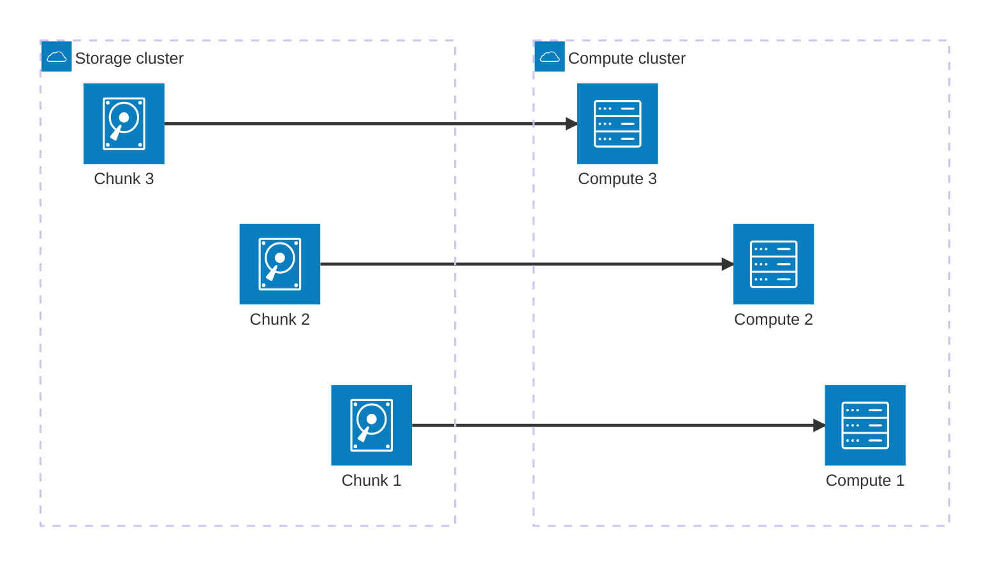
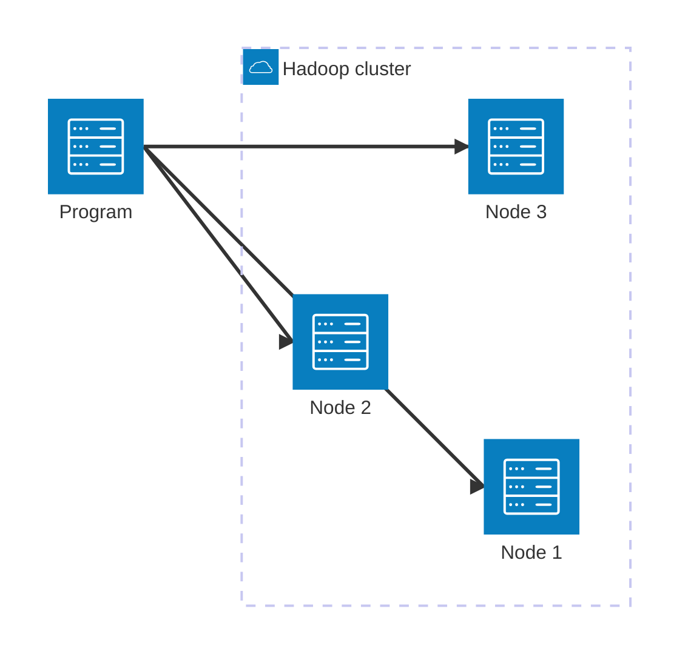
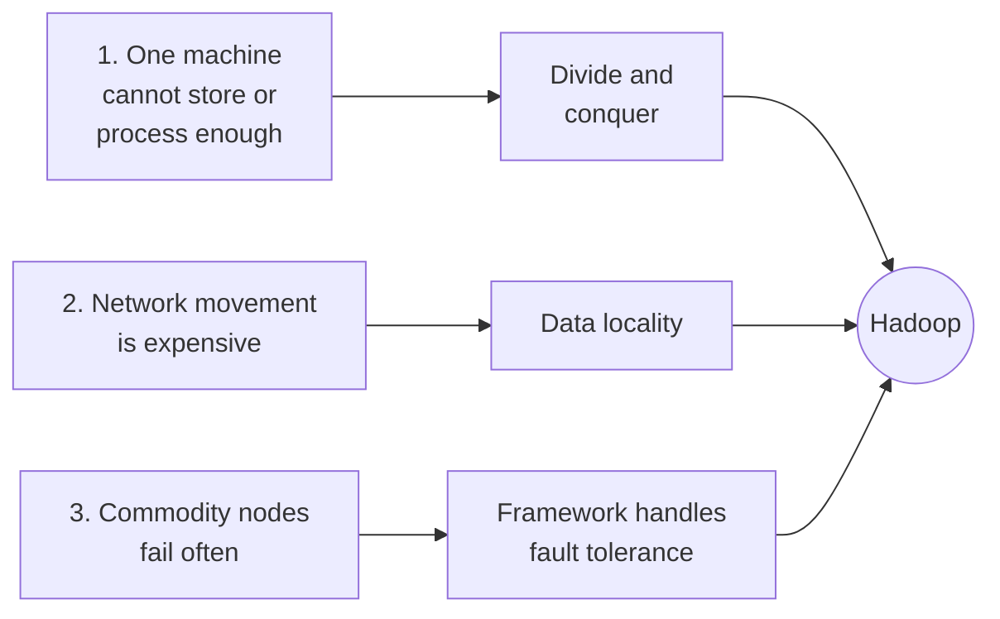

# Lecture 2 — Hadoop and the Distributed Idea

Last time we ended on a question: *if one machine is not enough, what does it actually take to run a job across many?* In this lecture we'll answer that with three concrete problems and three concrete ideas that, together, become **Hadoop** — the framework that made distributed big-data processing routine. We'll also do a short Python warm-up and pick up our first graded assignment.

## Key Terms

- **Cluster**: A collection of independent computers (nodes) connected over a network and treated as one system.
- **Commodity hardware**: Ordinary, inexpensive servers (not specialized supercomputers). Hadoop is designed to run on them and tolerate their failures.
- **Divide and conquer**: A computational strategy of splitting a large problem into smaller independent pieces, solving each in parallel, and combining the results.
- **MPI (Message Passing Interface)**: An older standard for writing programs that run across many nodes — programmer-controlled, network-heavy, fragile under node failure.
- **Data locality (data gravity)**: The principle of running computation **on the node that already holds the data**, instead of streaming the data across the network.
- **Fault tolerance**: A system's ability to keep running correctly when individual components fail.
- **Hadoop**: An open-source framework that handles distribution, networking, and fault tolerance so that application code can focus on the algorithm.

## 1. Quick recap of Lecture 1

- One machine's CPU, memory, or disk eventually becomes the limit.
- Sharding (by domain or by range) buys time, at the cost of application-layer complexity.
- "Big data" is whatever no longer fits in one machine cost-effectively. The V's give us language for *why*.
- The course's working sketch: user → program → big-data DB spread across a cluster.

> **Quick skills check (5 min, in class).** This course assumes some Python and basic data-wrangling experience, but the cohort comes from very different undergraduate backgrounds — so we will run a short ungraded survey at the start of class to calibrate pace and identify where scaffolding is needed. Be honest; "never used it" is a useful answer, not a wrong one.

## 2. Three problems we have to solve

Once we accept that data lives across many machines, three problems come with the territory. Hadoop is best understood as **three answers to three of them**.

### 2.1 Problem 1 — Single-machine compute does not scale

Suppose we have a 1 TB disk on one machine. Storing 300 GB or 700 GB is fine. Storing **2 TB** is not — it does not fit at all. Even when the data does fit, **processing** 1 TB of data on a single machine can take more than a day. Adding more cores to that one machine does not help: the CPU finishes its share quickly and then sits idle, waiting on a slow disk. This is the **"CPU heavy, I/O poor"** problem. Even high-end servers and GPUs are not a cost-effective answer.

**The only viable response is to scale *out*** — many machines, each with its own disk and CPU. The data is **chunked** across the machines, each machine processes its own chunk in parallel using the same program, and the results are combined at the end. This pattern is called **divide and conquer**, and it is the bedrock of every system we'll meet in this course.

### 2.2 Problem 2 — Moving data over the network is expensive

The first generation of distributed computing (think **MPI**) kept compute and storage in separate clusters. Programs ran on the compute nodes; data lived in the storage nodes. Every job had to:

1. Pull its data over the network from storage to compute.
2. Process it.
3. Push the result back.

As soon as data volume grew, the network became the bottleneck. Doubling the data did not double the job time — it more than doubled it, because *more bytes had to traverse the wire*.



The diagram above shows the **old MPI-style picture**: storage and compute are physically separate, and every job pays a network cost proportional to the data size — every arrow is a bulk-data transfer.

Hadoop's response is **data locality**: store the data on the **local disks of the compute nodes themselves**, and send the (tiny) program to the node that already holds the chunk it needs to process.



Each node inside the Hadoop cluster shown above owns **both** a slice of the data **and** the CPU that operates on it. Only the program — a few kilobytes of code — travels across the network. We will see this principle again when we meet HDFS (next lecture) and Spark (a few weeks out).

### 2.3 Problem 3 — Nodes fail, and they fail often

If we use commodity hardware (which we want to, for cost reasons), individual nodes **will** fail. The more nodes we have, the more often *some* node is failing right now. In a hand-rolled MPI world, every distributed application has to handle this itself: detect failures, retry work, rebalance, restart from checkpoints. Each new application re-implements the same infrastructure.

Hadoop's response is to provide a **common framework** that handles these concerns once and for all — distribution, networking, failure recovery, file management — so that **application code only contains the algorithm**, not the plumbing.

### 2.4 Putting it together — what Hadoop is

> **Hadoop** is an open-source software framework for storing and processing big data across a cluster of commodity servers using a simple programming model.



In one sentence: divide and conquer + data locality + a framework that handles failures. The diagram above is the whole story of Hadoop's design — three problems on the left, three responses in the middle, one framework on the right. The rest of the Hadoop ecosystem — HDFS for storage, MapReduce for compute, YARN for resource management — is the concrete implementation of those three ideas. We will meet each one in upcoming lectures.

## 3. Big data in the real world

Hadoop and the systems built around it underpin a wide range of workloads we'll meet later in the semester:

- **ETL at scale** — moving and reshaping data between systems at terabyte / petabyte scale.
- **Recommendation systems** — Netflix, Amazon, YouTube.
- **Real-time analytics** — fraud detection, ad bidding, user-behavior streams.
- **Machine learning at scale** — when the training set itself is too big for one machine.
- **Decision support** — forecasting, risk modeling, planning.

Most of you will meet these in your own work — clinical analytics, financial risk, marketing personalization, supply chain. The systems we'll study are the substrate beneath all of them.

## 4. Where the "data scientist" sits in this stack

The data-science role straddles two halves:

- A **data engineer** builds the pipelines that move and shape data — the storage layer, the processing layer, the orchestration. This is most of what CS-675 covers.
- An **applied data scientist** uses those pipelines to ask questions of the data — feature design, modeling, evaluation, deployment.

Real teams are usually a mix of both, and the skills shift across that line as careers develop. In this course we're touring the engineering side, but with enough applied-science framing that you can see how the two connect. The data-science lifecycle we sketched in Lecture 1 (Ask → Acquire → Clean → Explore → Build → Evaluate) sits *on top* of the systems we'll be building.

## 5. Lab — Python warm-up

A short in-class exercise to make sure everyone can run Python and read a CSV. **No platform setup required** — use whichever of these you prefer:

- **Google Colab** — open [colab.research.google.com](https://colab.research.google.com) in a browser, sign in with a Google account, create a new notebook. Zero install.
- **Local Jupyter** — if you already have Python and Jupyter on your machine.
- **VS Code with the Python extension** — also fine.

In your notebook, try this:

```python
import pandas as pd

# A tiny sample - we'll graduate to real datasets soon.
df = pd.DataFrame({
    "trip_id":   [1, 2, 3, 4, 5],
    "distance":  [2.1, 0.9, 5.4, 1.2, 3.8],
    "fare":      [9.50, 5.25, 18.00, 6.75, 14.20],
    "vendor":    ["A", "B", "A", "B", "A"],
})

print(df.head())
print(df.describe())
print(df.groupby("vendor")["fare"].mean())
```

If that runs and prints sensible output, you're ready for the rest of the semester. If it doesn't run, raise a hand — the help you need now is much cheaper than the help you'll need in week 4.

## 6. First assignment

The first graded assignment is handed out today. Details live in [`assignments/assignment-1.md`](./assignments/assignment-1.md) (added separately). At the highest level, it asks you to confirm three things:

1. **Docker** is installed and you can run a container.
2. **Python** is running on your machine (or in Colab) and you can load a CSV.
3. **Git** is set up and you can push to a course repo.

Specifics — including the due date and submission format — are in the assignment file. Read it before you leave today; it is short on purpose.

## Summary

- One machine isn't enough; we move to a cluster.
- Hadoop = **divide and conquer** + **data locality** + a framework that handles failures.
- Upcoming lectures unpack the pieces — HDFS, MapReduce, Spark, and the lakehouse layer on top.

## References & further reading

- Mendelevitch, Stella, and Eadline. *Practical Data Science with Hadoop and Spark*. Pearson, 2017 — Chapter 1 (Hadoop section).
- Dean, J. & Ghemawat, S. *MapReduce: Simplified Data Processing on Large Clusters*. OSDI 2004. (Preview for an upcoming lecture.)
- Ghemawat, S., Gobioff, H., and Leung, S.-T. *The Google File System*. SOSP 2003. (Preview for HDFS.)
