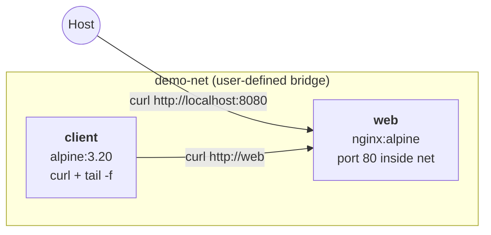

# Lesson 02 — Test with Compose + a custom network

> **Goal:** run a 2-service stack on a **user-defined bridge network**, prove that one container can reach the other by **service name** (DNS), then tear it down.

---

## Why a custom network?

Compose puts every service in the same project on a default network already. So why define one explicitly?

| Default network | User-defined bridge (what we use) |
|---|---|
| Auto-named `<project>_default` | Stable name you control (`demo-net`) |
| DNS works only inside that one project | Easy to attach external containers (`docker run --network demo-net ...`) |
| Implicit, easy to overlook | Explicit — readable diff in your `docker-compose.yml` |

Both use the **`bridge`** driver under the hood. A user-defined bridge enables automatic service-name DNS resolution between attached containers — that's the feature we'll verify.

---

## The stack

Two services, one network:



- `web` — `nginx:alpine`, serves the default welcome page.
- `client` — `alpine:3.20` with `curl` installed, idles forever so we can `exec` into it.
- Both attached to a custom bridge named `demo-net`.

The compose file lives at [`compose-demo/docker-compose.yml`](./compose-demo/docker-compose.yml).

---

## Run it

```bash
cd compose-demo

docker compose up -d
# Creating network "demo-net"  with the default driver
# Creating demo-web    ... done
# Creating demo-client ... done
```

Confirm both containers are healthy and the network exists:

```bash
$ docker compose ps
NAME          IMAGE          STATUS         PORTS
demo-client   alpine:3.20    Up 5 seconds
demo-web      nginx:alpine   Up 5 seconds   0.0.0.0:8080->80/tcp        # use HOST_PORT=NNN to change

$ docker network ls | grep demo-net
1f3a...   demo-net   bridge   local
```

---

## Test 1 — host can reach `web`

The compose file publishes nginx on host port `8080`:

```bash
$ curl -s http://localhost:8080 | head -n 5
<!DOCTYPE html>
<html>
<head>
<title>Welcome to nginx!</title>
```

This proves the **port mapping** works (host → container).

---

## Test 2 — `client` can reach `web` by service name

This is the network test. From inside the `client` container, hit `http://web` — note the hostname is just the **service name** from `docker-compose.yml`, no IP, no `.local`, no `localhost`:

```bash
$ docker compose exec client curl -s http://web | head -n 5
<!DOCTYPE html>
<html>
<head>
<title>Welcome to nginx!</title>
```

Compose's embedded DNS resolved `web` → the container's IP on `demo-net`. **This is what "Docker networking" buys you.**

You can also `ping` it (alpine's busybox ping works):

```bash
$ docker compose exec client ping -c 2 web
PING web (172.21.0.2): 56 data bytes
64 bytes from 172.21.0.2: seq=0 ttl=64 time=0.123 ms
64 bytes from 172.21.0.2: seq=1 ttl=64 time=0.087 ms
```

---

## Test 3 — inspect the network

See exactly which containers are attached:

```bash
$ docker network inspect demo-net --format '{{range .Containers}}{{.Name}} {{.IPv4Address}}{{"\n"}}{{end}}'
demo-client 172.21.0.3/16
demo-web    172.21.0.2/16
```

Both containers; both got an IP from the same subnet. That's a healthy bridge network.

---

## Tear down

```bash
docker compose down
# Stopping demo-client ... done
# Stopping demo-web    ... done
# Removing demo-client ... done
# Removing demo-web    ... done
# Removing network demo-net
```

`docker compose down` removes the containers **and the network** (named volumes survive — there are none in this demo). Add `-v` to also wipe volumes; add `--rmi local` to also delete pulled images.

---

## What changes per OS?

**Nothing.** Every command above is identical on macOS, Linux, and Windows (PowerShell, cmd, or WSL). The compose file deliberately avoids:

- Bind mounts (path-format differences across OSes)
- Host networking (`network_mode: host` — Linux-only)
- Platform-specific images
- Capabilities or sysctls

If you find yourself reaching for those, isolate them with **profiles** so the default `up` stays portable.

---

## Practice

1. Run the three tests above; all should succeed.
2. Add a third service `client2: image: alpine:3.20` to the compose file (also on `demo-net`), then verify `docker compose exec client2 wget -qO- http://web | head -n 1` resolves.
3. Run `docker compose down` then `docker network ls` — confirm `demo-net` is gone.
4. Bonus: change the network's `driver` to `bridge` with a custom `ipam.config.subnet` (e.g. `10.42.0.0/24`) and re-run the inspect command from Test 3 to see your subnet in effect.

> Once these all pass, your install is verified: engine, Compose v2, networking, and DNS all work end-to-end.
