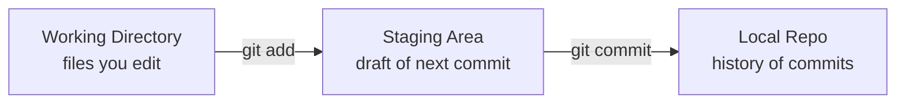

# Setup & Your First Commits

Git tracks versions of your project. Each save is a **commit** — a snapshot you can return to. Your code passes through three places before it's saved:



You edit files, stage the ones you want to save, then commit them.

## Install and configure

Check Git is installed and set your identity (every commit gets stamped with this).

```bash
$ git --version
git version 2.43.0

$ git config --global user.name "Jane Doe"
$ git config --global user.email "jane@example.com"
```

If Git isn't installed: `brew install git` (macOS) / `sudo apt install git` (Linux) / [Git for Windows](https://git-scm.com/download/win).

## Create a repo and make your first commit

```bash
$ mkdir my-analysis && cd my-analysis
$ git init
Initialized empty Git repository in /home/jane/my-analysis/.git/
```

The hidden `.git/` folder *is* the repo — it stores all history.

Create a file and ask Git what it sees:

```bash
$ echo "# My Analysis" > README.md
$ git status
On branch main
No commits yet
Untracked files:
        README.md
```

`README.md` is **untracked** — Git sees it but isn't watching it yet. Stage it, then commit:

```bash
$ git add README.md
$ git commit -m "Initial commit"
[main (root-commit) 8c4d2f1] Initial commit
 1 file changed, 1 insertion(+)
```

`8c4d2f1` is this commit's permanent ID (its SHA hash).

## Make changes and commit again

Edit the file, then see what changed:

```bash
$ echo "Predicting customer churn." >> README.md
$ git diff
diff --git a/README.md b/README.md
+Predicting customer churn.
```

`git diff` shows what's changed since your last commit. `+` is added, `-` is removed. Stage and commit:

```bash
$ git add README.md
$ git commit -m "Describe project"
[main 1a9e3c2] Describe project
```

## See your history

```bash
$ git log
commit 1a9e3c2... (HEAD -> main)
Author: Jane Doe <jane@example.com>
Date:   Fri May 9 14:22:10 2026 -0400

    Describe project

commit 8c4d2f1...
Author: Jane Doe <jane@example.com>
Date:   Fri May 9 14:18:03 2026 -0400

    Initial commit
```

`HEAD -> main` on the top commit means you're at the tip of the `main` branch.

To inspect a single commit — its message, author, and full diff — pass its SHA to `git show`:

```bash
$ git show 1a9e3c2
commit 1a9e3c2... (HEAD -> main)
Author: Jane Doe <jane@example.com>
Date:   Fri May 9 14:22:10 2026 -0400

    Describe project

diff --git a/README.md b/README.md
+Predicting customer churn.
```

Write commit messages in the imperative ("Add feature", not "Added feature") and keep one commit to one logical change.

> **Next:** [Branches & Merging](./02-branches-and-merging.md)
