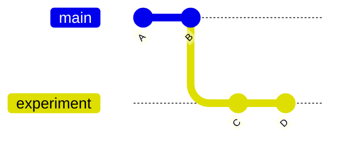
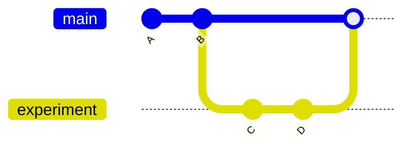

# Branches & Merging

A **branch** is a parallel line of work. You can experiment on one branch without touching `main`. If it works, merge it back. If not, throw it away. Branches are cheap — Git doesn't copy files, it just creates a new pointer.



## Create a branch and commit on it

```bash
$ git switch -c experiment/new-features
Switched to a new branch 'experiment/new-features'

$ echo "x_squared = x ** 2" >> features.py
$ git add features.py && git commit -m "Try x_squared feature"
[experiment/new-features 7d2a4f1] Try x_squared feature
```

`-c` creates the branch. Naming with a prefix (`experiment/`, `feature/`) keeps things organized — slashes don't make folders, they're just part of the name.

## Switch back to main — your file reverts

```bash
$ git switch main
$ cat features.py
# (no x_squared line — back to main's version)
```

The experimental commit isn't lost; it just lives on the other branch. Switch back any time:

```bash
$ git switch experiment/new-features
$ cat features.py
x_squared = x ** 2
```

List all branches — `*` shows your current one:

```bash
$ git branch
  main
* experiment/new-features
```

## Merge it back into main

When the experiment works, bring it into `main`:

```bash
$ git switch main
$ git merge experiment/new-features
Updating 1a9e3c2..7d2a4f1
Fast-forward
 features.py | 1 +
```

`Fast-forward` means `main` had no new commits, so Git just slid the pointer forward.



Delete the merged branch to keep things clean:

```bash
$ git branch -d experiment/new-features
Deleted branch experiment/new-features (was 7d2a4f1).
```

## When merge can't decide for you — conflicts

If you and someone else changed the **same lines of the same file**, Git stops the merge and asks you to pick. You'll see something like:

```bash
$ git merge experiment/new-features
Auto-merging app.py
CONFLICT (content): Merge conflict in app.py
Automatic merge failed; fix conflicts and then commit the result.
```

Run `git status` to confirm which files need attention:

```bash
$ git status
You have unmerged paths.
  (fix conflicts and run "git commit")
  (use "git merge --abort" to abort the merge)

Unmerged paths:
  (use "git add <file>..." to mark resolution)
        both modified:   app.py
```

Open the file and Git has marked the disagreement directly:

```python
def get_master():
<<<<<<< HEAD
    return "local[*]"
=======
    return "local[4]"
>>>>>>> experiment/new-features
```

- The block between `<<<<<<< HEAD` and `=======` is **your version** (main's).
- The block between `=======` and `>>>>>>> experiment/new-features` is **theirs**.

To resolve: edit the file so it contains the final code you want — keep yours, keep theirs, combine, or write something new — and **delete all three marker lines** (`<<<<<<<`, `=======`, `>>>>>>>`). Then mark it resolved and commit:

```bash
$ git add app.py
$ git commit
```

The commit message pre-fills as `Merge branch 'experiment/new-features'` — accept it.

**Escape hatch:** if you'd rather start over without resolving, abort the merge — your repo returns to exactly where it was before:

```bash
$ git merge --abort
```

Nothing lost; you can revisit the merge later.

## Throw away an experiment

If the branch didn't pan out, force-delete it (`-D` instead of `-d` skips the "branch isn't merged" check):

```bash
$ git switch main
$ git branch -D experiment/new-features
Deleted branch experiment/new-features (was 7d2a4f1).
```

## Heads up: uncommitted changes block switching

If you try to switch with unsaved edits, Git refuses to overwrite them:

```bash
$ git switch main
error: Your local changes to the following files would be overwritten by checkout:
        features.py
Please commit your changes or stash them before you switch branches.
```

Either commit them, or shelve them with `git stash` (next page).

> **Next:** [Undoing & Recovery](./03-undoing-and-recovery.md)
