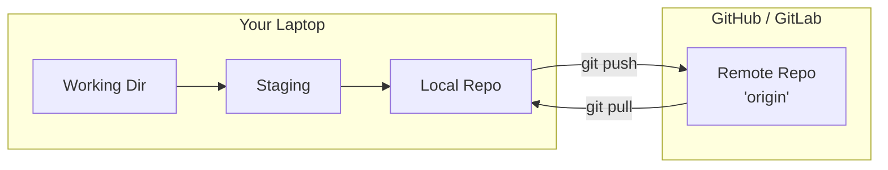

# Remotes & Collaboration

A **remote** is just another copy of your repo, hosted somewhere reachable (GitHub, GitLab). The default name for it is `origin`. The remote only sees commits you've pushed — never your working dir or staging area.



## Clone an existing repo

```bash
$ git clone https://github.com/team/ml-pipeline.git
$ cd ml-pipeline
$ git remote
origin
```

`origin` is set up automatically. You now have full history locally.

## Connect a new local repo to a remote

If you started with `git init` and want to push to GitHub, create an empty repo there (no README), then:

```bash
$ git remote add origin git@github.com:jane/my-analysis.git
$ git push -u origin main
 * [new branch]      main -> main
branch 'main' set up to track 'origin/main'.
```

`-u` ("upstream") links your local `main` to `origin/main`. After this first push, plain `git push` and `git pull` need no arguments.

## Daily sync

Pull teammates' changes before starting work:

```bash
$ git pull
Updating 4f2a1b9..b8d3e10
Fast-forward
 features.py | 12 ++++++++++--
```

After making commits, push them up:

```bash
$ git push
To github.com:jane/my-analysis.git
   b8d3e10..c2f9a31  main -> main
```

For a new branch, the first push needs `-u`:

```bash
$ git switch -c feature/login
# ...commit...
$ git push -u origin feature/login
 * [new branch]      feature/login -> feature/login
branch 'feature/login' set up to track 'origin/feature/login'.
```

## When push is rejected

If teammates pushed since you last pulled:

```bash
$ git push
 ! [rejected]   main -> main (fetch first)
hint: Updates were rejected because the remote contains work you do not have locally.
```

Pull first, then push:

```bash
$ git pull
$ git push
```

Don't `git push --force` to fix this — it overwrites others' work.

## The pull request workflow

For team projects, the standard flow is: branch off `main`, push, open a PR on GitHub, get it reviewed and merged, then clean up locally.

```bash
$ git switch main && git pull
$ git switch -c feature/new-thing
# ...work, commit...
$ git push -u origin feature/new-thing
# Open a PR on GitHub UI; after it's reviewed and merged:
$ git switch main && git pull
$ git branch -d feature/new-thing
```

This protects `main` from accidental breakage and gives a review trail.

## .gitignore — what NOT to commit

For a DS project, never commit datasets, models, secrets, or caches. Create `.gitignore` at the repo root:

```gitignore
# Data & models
data/
*.csv
*.parquet
*.pkl

# Python
__pycache__/
.venv/
.ipynb_checkpoints/

# Secrets
.env

# OS / editors
.DS_Store
.vscode/
```

Now Git ignores those files entirely:

```bash
$ touch data/big_file.csv analysis.py
$ git status
Untracked files:
        analysis.py
        .gitignore
```

`big_file.csv` doesn't even appear. If you already committed something you shouldn't have, untrack it:

```bash
$ git rm --cached data/big_file.csv
rm 'data/big_file.csv'
$ git commit -m "Stop tracking big_file.csv"
```

The file stays on disk; Git just stops watching it. **For secrets:** removing them from a future commit isn't enough — they're still in history. **Rotate the secret immediately.**

For Jupyter notebooks, install [`nbstripout`](https://github.com/kynan/nbstripout) so cell outputs don't bloat your diffs:

```bash
$ pip install nbstripout && nbstripout --install
```

> [Back to README](./README.md)
