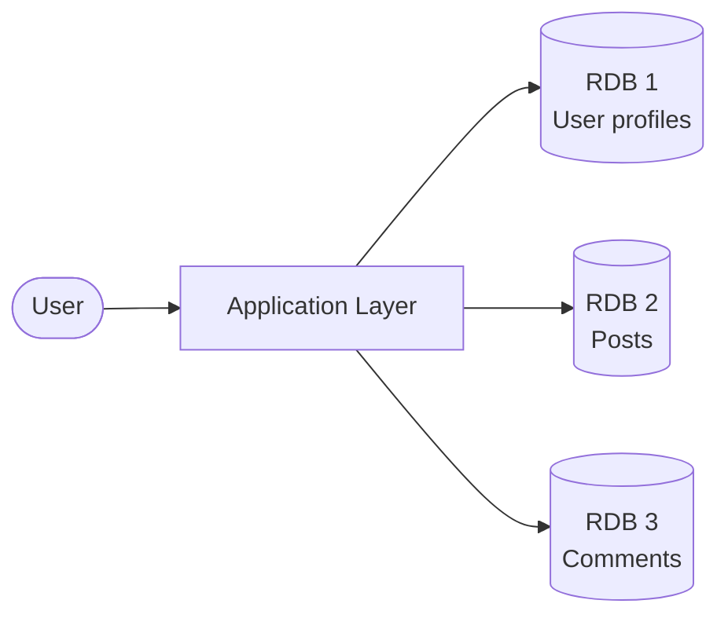
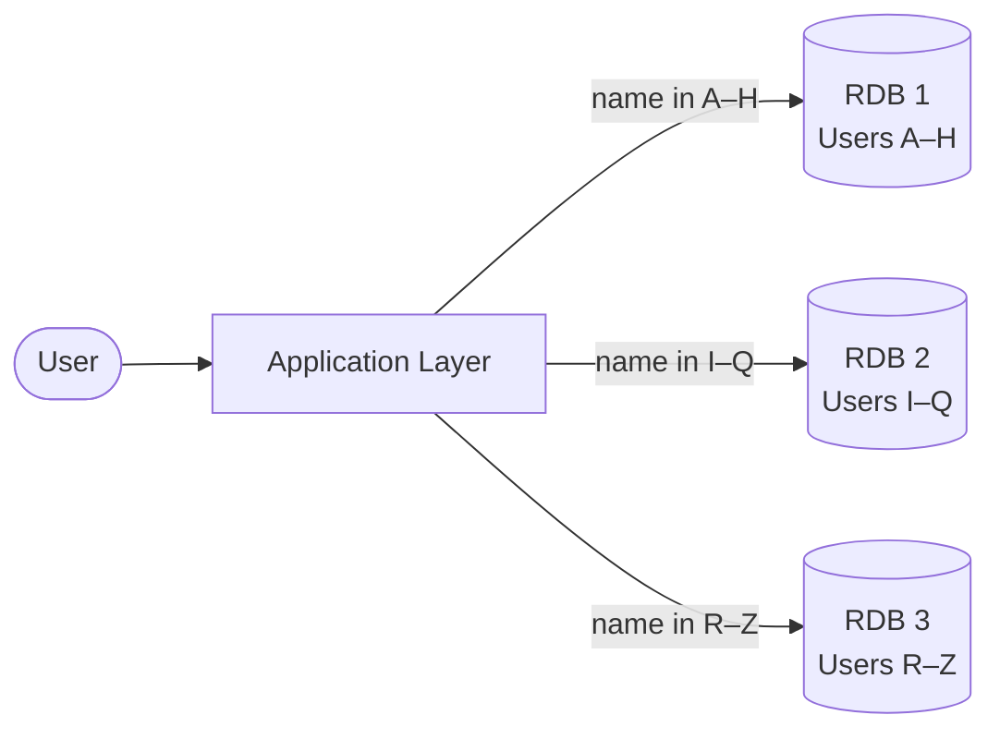
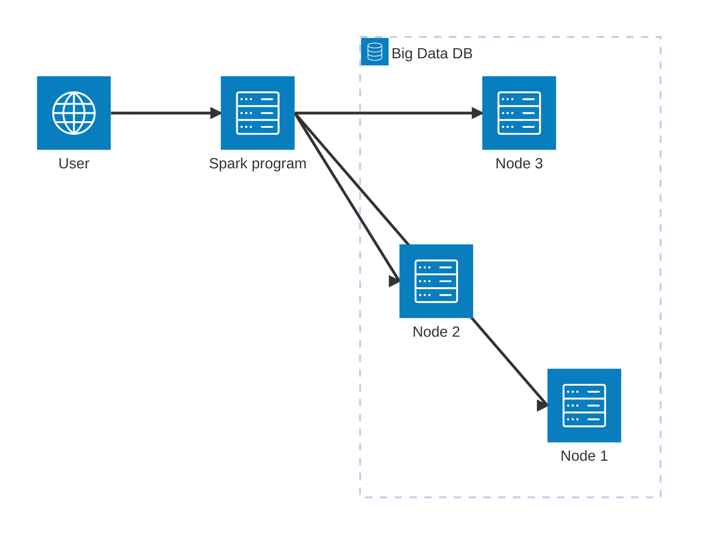

# Lecture 1 — Why Big Data?

Welcome to CS-675. In this first class we set up the language we will use all semester: what we mean by "big data," why traditional databases stop being a good fit at scale, and the very first sketch of a system architecture that can handle data larger than one machine. The companion diagram for this lecture is in [`CS-675-1.drawio.pdf`](./CS-675-1.drawio.pdf) (source: `CS-675-1.drawio`).

## Key Terms

- **RDBMS**: Relational Database Management System — software that stores data in related tables (e.g., MySQL, Oracle, PostgreSQL).
- **RDB**: A relational database — the actual store of tables and rows managed by an RDBMS.
- **Sharding (Partitioning)**: Splitting a single logical dataset across multiple physical databases so each one holds only a slice.
- **OLTP**: Online Transaction Processing — short, frequent, consistent writes. The world RDBMSs were designed for.
- **OLAP**: Online Analytical Processing — large reads over historical data for analysis. The world big-data systems mostly serve.
- **Transactional database**: A database that supports transactions (ACID). Example: any standard RDBMS.
- **Operational database**: A database used for day-to-day reads/writes but **without** transaction guarantees. Example: most NoSQL stores (MongoDB, Cassandra, HBase).
- **The V's of Big Data**: A set of properties (volume, velocity, variety, value, veracity, variability, volatility, complexity) used to characterize what makes a dataset "big."
- **Data locality**: The principle of moving computation to the node holding the data rather than streaming the data to the node running the computation. (We will use this in Lecture 2.)

## 1. Why one database is not enough

A standard relational database (MySQL, PostgreSQL, Oracle) is excellent at what it was designed for: structured data, ACID transactions, and queries that join across tables. The catch is that it runs on **a single machine** — so it inherits that machine's physical limits:

- **CPU** — how many cores can drive the engine.
- **Memory (RAM)** — how much working data fits before paging to disk.
- **Disk (Storage)** — how much data we can keep at all, and how fast we can read it.

As data grows, we hit one of these walls before the others. A high-end server can postpone the day, but cannot remove the ceiling. To go further, we have to give up on "one machine" as a design assumption.

## 2. The first attempt: sharding

If one machine is not enough, can we split the data across many? Yes — and the way we split matters. We will look at two common strategies using a simplified social-network example: a system that stores user profiles, posts, and comments. The drawio diagram walks through both.

### 2.1 Sharding by domain

Each domain (entity type) lives on its own database:

| Database | Contents |
|---|---|
| RDB 1 | All user profile information |
| RDB 2 | All posts |
| RDB 3 | All comments |

The application layer is responsible for knowing which database holds which domain, and for stitching results back together. In the diagram above, every request passes through the application, which then routes to whichever database owns the requested domain. A "user with their posts and comments" query now spans three machines — so application code gets more complicated, but each database stays manageable.

### 2.2 Sharding by range

Each database holds **the same** domain — say, users — but only a slice of the key range:

| Database | Contents |
|---|---|
| RDB 1 | Users with names A – H |
| RDB 2 | Users with names I – Q |
| RDB 3 | Users with names R – Z |

A single-user query now goes to exactly one database (whichever owns the key range), as the labelled edges show. The application layer is simpler than in domain sharding, but rebalancing — what happens when "M–N" suddenly has half your traffic — becomes a real concern.

> Sharding is a partial answer. It keeps us in relational territory, at the cost of moving complexity into the application layer. Eventually, even sharding hits diminishing returns — which is what motivates the rest of the course.

## 3. OLTP vs OLAP

Two distinct shapes of database workload show up in the wild:

| | OLTP | OLAP |
|---|---|---|
| Workload | Short, frequent transactions | Large, infrequent analytical queries |
| Reads vs writes | Mixed | Read-heavy |
| Data freshness | Real-time | Often historical / batched |
| Typical user | An application or end-user | An analyst, a model, a dashboard |
| Typical store | RDBMS | Big data system / warehouse / lakehouse |

Most of the technology we'll meet this semester is OLAP-leaning. Knowing which side of this split a system is built for is the single best predictor of how it will behave under load.

## 4. So what is "big data"?

A working definition we'll use throughout the course:

> Big data is data that **exceeds the cost-effective capacity** of traditional storage, computation, and algorithms on a single machine.

This is deliberately relative. 10 GB of video is big on a phone and small on a workstation. The interesting question is never "how big is big," but **"big relative to what?"** A few common framings:

- **Volume** — more data tends to produce better decisions, if we can process it.
- **Velocity** — incoming data arrives continuously; we may need to react in real time.
- **Variety** — structured tables, semi-structured logs, unstructured audio/video/text all in one system.
- **Value** — large datasets can outperform fancier algorithms run on small ones.
- **Veracity** — public data is often unreliable; provenance matters.
- **Variability, Volatility, Complexity** — sources change, data ages out, and entities are deeply interconnected.

You will see lists of 3 Vs, 5 Vs, even 10 Vs in the literature. The names matter less than the underlying property: **what makes this dataset hard to manage?**

## 5. A first scale-classification

A useful rule of thumb (we'll refine it later in the semester):

| Class | Size | Typical tools | Why it fits |
|---|---|---|---|
| Small | < 10 GB | Excel, R, MATLAB, pandas | Barely fits in one machine's memory |
| Medium | 10 GB – 1 TB | Data warehouses, single-server RDBMS | Barely fits on one machine's disk |
| Big | > 1 TB | Hadoop, Spark, distributed databases | Has to live across many machines |

The course is about the third row. Everything we cover from Lecture 2 onward is a tool for living in that row.

## 6. A first system sketch

The closing block of the diagram introduces a deliberately oversimplified picture: a user submits a Spark Python program, which runs against a *big data DB* whose data is spread across a cluster of machines:

Three things are deliberately glossed over: how data ends up on those nodes, how the Spark program is split across them, and what happens when one of them fails. We will spend most of the rest of the course unpacking each — the cluster filesystem (HDFS, Lecture 3), the parallel programming model (MapReduce, Lecture 4; Spark, Lecture 5), and the alternative stores that sit behind the same shape (NoSQL, lakehouse formats, later in the semester).

For now, the picture is enough: when one machine cannot do the job, we move to many — and that creates a new set of problems we'll spend the semester solving.

## 7. What's coming next

In **Lecture 2** we will pick up here and ask: *given that we want to run computation across many machines, what makes that hard, and how does Hadoop answer those problems?* We'll meet three failure modes specific to distributed compute, and three corresponding ideas (divide-and-conquer, data locality, fault-tolerant frameworks) that Hadoop introduced.

## Lab / Assignment

No assignment for this lecture — graded assignments start in **Lecture 2**. To prepare:

- Re-read the diagram in [`CS-675-1.drawio.pdf`](./CS-675-1.drawio.pdf) and the **Key Terms** above; this vocabulary will come up again next class.
- Skim the Hadoop section of *Practical Data Science with Hadoop and Spark* (Mendelevitch et al., Chapter 1) if you have access. We will cover the same material in class.
- Make sure **Docker is installed** on the machine you'll use for the course — the Lecture 2 assignment will start there. Watch [`../lecture-2/assignments/`](../lecture-2/assignments/) for it once we hand it out.

## Summary

- One RDBMS hits a CPU / memory / disk wall on big data.
- **Sharding** postpones the wall by pushing complexity into application code.
- Past ~1 TB, data must live across many machines — the rest of the course is about that world.

## References & further reading

- Mendelevitch, Stella, and Eadline. *Practical Data Science with Hadoop and Spark*. Pearson, 2017 — Chapter 1.
- Stonebraker, M. *The End of an Architectural Era (It's Time for a Complete Rewrite)*. VLDB 2007 — background on why RDBMSs hit scale walls.
- The diagram in [`CS-675-1.drawio.pdf`](./CS-675-1.drawio.pdf) — visual summary of everything above.
