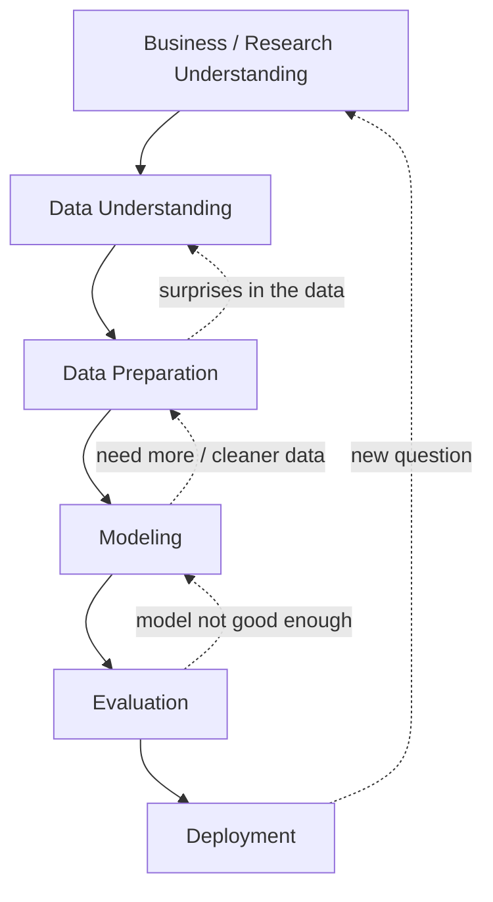
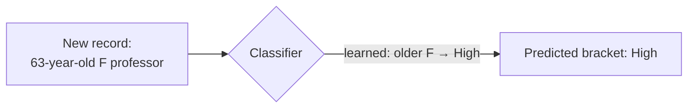

# Lecture 2b — Introduction to Data Mining

So far we've looked at *what makes data "big"* and how Hadoop helps us process it. The other half of the course asks: **once we have the data, what do we do with it?**

This lecture covers four things: a definition of data mining, the **CRISP-DM** process practitioners use, the common **fallacies** to avoid, and the **six standard data-mining tasks** with examples from clinical, financial, and marketing settings.

Source: Larose & Larose, *Data Mining and Predictive Analytics* (Wiley, 2015), Chapter 1.

## Key Terms

- **Data mining**: The *process* of discovering useful patterns and trends in large data sets — not a tool you buy, but a discipline you practice.
- **CRISP-DM**: Cross-Industry Standard Process for Data Mining — a six-phase, iterative lifecycle used to structure a data-mining project from business problem to deployed model.
- **Training set**: A set of records where we already know the answer (target value); we use it to *teach* the model.
- **Predictor variable**: An input column — something we observe about each record (e.g. age, sodium level, transaction amount).
- **Target variable**: The output we want the model to estimate or assign — numeric (estimation), categorical (classification), or future-valued (prediction).
- **EDA (Exploratory Data Analysis)**: The graphical / summary step where we look at the data before modelling — distributions, outliers, missing values.
- **Association rule**: A rule of the form *IF antecedent THEN consequent*, scored by **support** (how often the combination appears) and **confidence** (how often the consequent follows the antecedent).

## 1. What is Data Mining?

**Data mining is the process of discovering useful patterns and trends in large data sets.** Two things to notice in that sentence:

- It is a **process**, not a button. No software does data mining for you while you fetch coffee.
- "Useful" depends on the business or research question. A pattern that doesn't change a decision is not useful.

Two examples of what this looks like in practice:

- **U.S. 2012 Presidential election** — the Obama campaign used a data-mining model to identify *likely* Obama voters and make sure they got to the polls. A separate model predicted county-by-county outcomes. In Hamilton, Ohio, the model said 56.4%; the actual result was 56.6% — off by 0.02%.
- **Bank of America's West Coast call center** — 13 million customer calls a month. Before data mining, every caller heard the same up-sell. After: agents see each caller's profile and offer products tailored to that specific person.

### Why now?

A few forces have come together:

- Explosive growth in collected data (scanners, sensors, web logs, social media).
- Cheap storage and warehouses to hold it.
- Easy web/intranet access for anyone to query it.
- Competitive pressure — your competitors are doing it.
- More compute and storage at lower cost.

**But we are short on people who can do this well.** McKinsey projects a shortage of 140,000–190,000 deep-analytics roles in the US, plus 1.5 million managers and analysts who know how to *use* big-data insights. That shortage is a big part of why a course like this exists.

### Data mining is NOT automatic

An early misconception was that data mining could be "turned loose" on a data store and return answers. It cannot. From Berry & Linoff:

> "this has misled many people into believing data mining is a product that can be bought rather than a discipline that must be mastered."

Humans must be involved in every phase. §2 below makes this concrete — two of the six phases (Business Understanding, Evaluation) depend on judgment, not algorithms.

## 2. The CRISP-DM Lifecycle

**CRISP-DM** (Cross-Industry Standard Process for Data Mining) was developed in 1996 by a consortium including DaimlerChrysler, SPSS, and NCR. It is **industry-, tool-, and application-neutral**, non-proprietary, and freely available — which is why it has stuck around for almost three decades.

It has **six phases** and is explicitly **iterative**: you usually don't move strictly forward through them; you cycle back when something earlier turns out to need rework.

The dashed arrows are the key insight: **CRISP-DM is a loop, not a pipeline.** Almost every real project bounces back to an earlier phase at least once. The six phases:

1. **Business / Research Understanding.** Define what problem we are actually solving. Translate that into a data-mining problem statement. Draft a preliminary strategy. *This is where the project succeeds or fails before any code is written.*
2. **Data Understanding.** Collect the data. Do EDA — plots, summaries, sanity checks. Assess data quality. Optionally pick interesting subsets.
3. **Data Preparation.** Select the cases and variables you'll actually use. Clean the data. Transform variables where needed. *This phase typically takes the most time on a real project.*
4. **Modeling.** Select and apply one or more modelling techniques. Tune their settings. (Sometimes Modeling tells you the data needs more prep — that's the dashed arrow back to phase 3.)
5. **Evaluation.** Did the model achieve the business objective? Is there a piece of the problem we accidentally ignored? Should we deploy or rebuild?
6. **Deployment.** Use the model. The simple case: generate a report. The complex case: hand it off to another team or product. Sometimes the customer takes it from here based on your model.

The pattern to internalize: **the algorithm is one phase out of six.** A data mining project is mostly framing the question, then mostly cleaning the data, with a relatively small block in the middle that is the actual modelling. Resist the temptation to start at phase 4.

## 3. Common Fallacies

It helps to know what data mining is *not*, because the misconceptions are persistent. Seven that recur:

| # | Fallacy | Reality |
|---|---|---|
| 1 | A tool can be turned loose on a data repository and will find answers to all business problems. | No tool solves problems by itself — data mining is a *process* (CRISP-DM) that integrates with business objectives. |
| 2 | The process is autonomous and needs little oversight. | Every phase requires intervention. Deployed models need continual monitoring and updates. |
| 3 | Data mining quickly pays for itself. | Return rates vary widely — startup, personnel, and data-preparation costs are real. |
| 4 | Data-mining software is easy to use. | Ease of use varies by project; analysts must combine domain knowledge with technical skill. |
| 5 | Data mining identifies *causes* of business problems. | It uncovers *patterns*; humans interpret those patterns and propose causes. |
| 6 | Data mining automatically cleans data in databases. | It often uses legacy data that hasn't been touched in years. Cleaning is a huge separate task. |
| 7 | Data mining always produces positive results. | There is no guarantee. Used well, it can produce highly profitable results — used badly, it produces noise. |

The thread tying these together: **data mining is a discipline you apply, not a service that runs on its own.** Fallacies 5 and 6 are the most expensive ones to forget — they are the difference between a project that gets actionable answers and one that produces a tidy report that nobody acts on.

## 4. The Six Data-Mining Tasks

Almost every data-mining problem maps onto one of six standard tasks. The two big questions are: **is there a target variable we want to predict?** and if yes, **what kind of value is it** — a number, a category, or something in the future?

| # | Task | Target variable | The question it answers | Domain example |
|---|---|---|---|---|
| 1 | **Description** | none | *What patterns are in this data?* | "Why are recently laid-off voters less likely to support the incumbent?" |
| 2 | **Estimation** | numeric | *What's the value of Y for a new record?* | Estimate systolic blood pressure from age, BMI, sodium level. |
| 3 | **Prediction** | numeric or categorical, in the future | *What WILL happen?* | Predict next quarter's stock price from past performance. |
| 4 | **Classification** | categorical | *Which category does this record belong to?* | Is this credit-card transaction fraud or not? |
| 5 | **Clustering** | none | *Which records are similar to each other?* | Group customers by purchasing behaviour to design targeted campaigns. |
| 6 | **Association** | none (rules) | *What things go together?* | Customers who bought diapers also bought beer. |

We'll walk through each of them.

### 4.1 Description

Description **summarizes patterns or trends in the data**, often as the first thing we do after Data Understanding. A pollster might notice that recently laid-off voters are less likely to support the incumbent — and then *suggest an explanation* (less financial security → preference for change).

Two things matter for description:

- The data-mining model should be **transparent** — its output must be interpretable by humans. *Decision trees* are very transparent (they spell out their reasoning as if/then rules); *neural networks* are opaque (they give an answer but not a clear "why").
- High-quality description leans on **Exploratory Data Analysis (EDA)** — graphical methods (histograms, scatter plots, box plots) to see what's in the data before we model it.

### 4.2 Estimation

Estimation is **like classification, except the target is numeric** (a real number rather than a category). We use a training set where we already know the answer; the model learns the relationship; we apply the model to new records to estimate their (still unknown) target value.

Examples:

- Estimate a patient's systolic blood pressure from age, gender, BMI, sodium level.
- Estimate a graduate student's GPA from their undergraduate GPA.

#### A worked example: linear regression on GPA

Figure 1.2 in the textbook slides (page 17 of DataPreparation-LectureNotes-Week3.pdf) shows a scatter plot of graduate GPA versus undergraduate GPA for 1000 students, with the best-fitting regression line drawn through it. Linear regression chooses the line that minimizes the total error across all points; for this dataset, the line is:

`ŷ = 1.24 + 0.67 x`

Where `ŷ` is the estimated graduate GPA and `x` is the undergraduate GPA. So for a student with `x = 3.0`, the estimated graduate GPA is `1.24 + 0.67 × 3.0 = 3.25`. That point sits exactly on the regression line.

This is the simplest possible estimator. We'll meet more sophisticated ones later in the course.

### 4.3 Prediction

Prediction looks like classification or estimation, with one twist: **the answer is in the future.** Methods used for classification and estimation apply directly — *k*-nearest neighbour, decision trees, neural networks, linear regression. The difference is that we are forecasting a value we don't yet have.

Examples:

- Predict the price of a stock three months from now from its past performance.
- Predict whether a molecule in a newly discovered drug will turn into a profitable pharmaceutical.
- Predict next year's traffic deaths if the speed limit were raised.

The line between "estimation" and "prediction" is *time*: if the target value exists right now (just not in our hands yet), it's estimation; if it doesn't exist yet, it's prediction.

### 4.4 Classification

Classification is **estimation with a categorical target.** Same supervised-learning setup — training set with known categories, model learns, model assigns categories to new records. The difference is that the answer is "low / middle / high" rather than `3.25`.

#### A small example

Suppose we want to classify each person into an income bracket (Low / Middle / High) based on Age, Gender, and Occupation:

| Subject | Age | Gender | Occupation | Income Bracket |
|---|---|---|---|---|
| 001 | 47 | F | Software Engineer | High |
| 002 | 28 | M | Marketing Consultant | Middle |
| 003 | 35 | M | Unemployed | Low |
| ... | ... | ... | ... | ... |

The algorithm examines this training set, learns which *combinations* of predictor values associate with which bracket (for example, "older + female" tends to mean "high"), and then assigns brackets to records where the answer is unknown:

#### Where classification shows up

- Is this credit-card transaction fraudulent or not?
- Is this mortgage applicant a good or bad credit risk?
- Does this patient have the disease, given their symptoms and test results?

#### A two-predictor example: which drug to prescribe?

The textbook walks through a classification problem with only two predictors — patient age (x-axis) and patient sodium / potassium ratio (y-axis) — and the target is which drug was previously prescribed. With only two predictors, we can visualize the entire training set as a scatter plot. Figure 1.3 in the textbook slides (page 23 of DataPreparation-LectureNotes-Week3.pdf) shows 200 past patients plotted that way, with their points shaded according to which drug they received:

- Light grey → Drug Y
- Medium grey → Drug A or X
- Dark grey → Drug B or C

To classify a new patient, we find where they would land on the plot and look at what colour dominates that region.

- **Young patient with high Na/K ratio** → upper-left region → past patients there got **Drug Y**, so we recommend Drug Y. Confident classification.
- **Older patient with low Na/K ratio** → lower-right region → past patients there got a mix of dark grey (B or C) and medium grey (A or X). **Definitive classification is not possible without more predictors.**

That second case is the entire reason we need fancier methods: in real problems, two predictors are almost never enough.

#### Handling many predictors

When there are more than 2–3 predictor variables we can't just eyeball a scatter plot. The standard tools then become **k-nearest neighbour** (Chapter 7), **decision trees** (Chapter 8), and **neural networks** (Chapter 9). We will not study their internals in this course, but you should recognise the names.

### 4.5 Clustering

Clustering is the first task we've seen with **no target variable.** We aren't trying to predict anything — we just want to group records so that records inside a group are similar to each other and dissimilar from records in other groups.

#### A real-world example: PRIZM segmentation

**Nielsen Claritas' PRIZM** system clusters every American ZIP code into one of 66 demographic profiles. For ZIP code 90210 (Beverly Hills, CA), three of the matching clusters are:

- #01: *Upper Crust*
- #04: *Young Digerati*
- #07: *Money and Brains*

PRIZM describes cluster #01 (*Upper Crust*) as **the nation's most exclusive address** — a haven for empty-nesting couples earning over $100,000/year.

No one *told* PRIZM that 90210 was wealthy. The clustering algorithm discovered the grouping from demographic features alone. (The full 66-cluster table appears on page 26 of DataPreparation-LectureNotes-Week3.pdf.)

#### Where clustering shows up

- Target-marketing a niche product when you can't afford broad advertising.
- Segmenting financial behaviour into "benign" and "suspicious" buckets for accounting.
- Gene-expression clustering, where huge numbers of genes exhibit similar behaviour.

The two most common clustering algorithms — **hierarchical clustering** and **k-means** — appear in Chapter 10 of the book.

### 4.6 Association

Association looks for **which attributes go together.** Most commonly we phrase the answer as a rule:

> **IF antecedent THEN consequent**

…and we score every candidate rule using two numbers:

- **Support** — how often does the rule's antecedent *and* consequent appear together in the data?
- **Confidence** — *given* that the antecedent appears, how often does the consequent also appear?

#### An example

A streaming service looks at a month of viewing data. Of 10,000 active users:

- 2,000 watched a particular sci-fi show.
- Of those 2,000, 600 also watched a particular fantasy show.

The association rule **IF watched the sci-fi show THEN watched the fantasy show** has:

- Support = 2,000 / 10,000 = **20%** — the combination shows up in 20% of all users.
- Confidence = 600 / 2,000 = **30%** — *given* a viewer watched the sci-fi show, there's a 30% chance they also watched the fantasy show.

This is **market-basket analysis** (also called **affinity analysis**). The rule alone tells us nothing about *why* the two shows go together — but it's enough information to recommend the fantasy show next time a sci-fi viewer opens the app and see whether watch-through rates improve.

#### Where association shows up

- Which items in a supermarket are purchased together — and which are *never* purchased together.
- The proportion of cases in which a new drug exhibits dangerous side effects.

The two classic association-rule algorithms — **a priori** and **GRI** — appear in Chapter 12 of the book.
