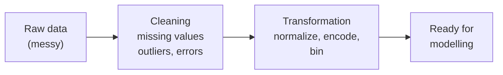
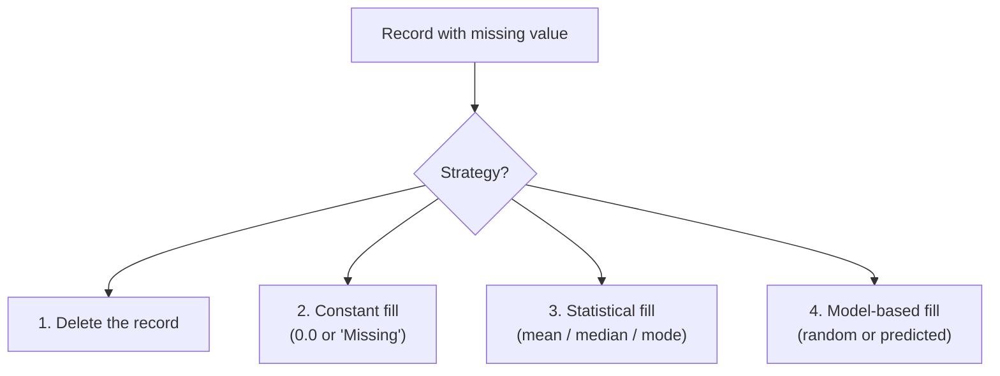
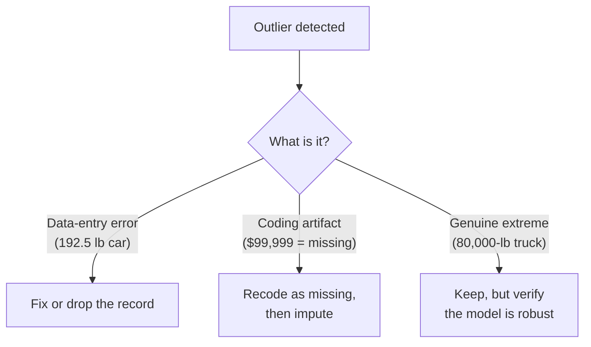

# Lecture 3 — Data Preparation

In Lecture 2b we surveyed *what* data mining can do. Before any of those tasks works in practice, the data has to be cleaned, normalized, and shaped into a form the algorithms can actually consume. That's the **data preparation** phase of CRISP-DM — and according to Pyle, it accounts for **about 60% of the effort** on a typical data-mining project.

This lecture covers what that 60% looks like: handling missing values, dealing with outliers, normalizing numbers onto comparable scales, turning categorical variables into numeric form, and a few other cleanup operations.

Source: Larose & Larose, *Data Mining and Predictive Analytics* (Wiley, 2015), Chapter 2 (data preparation portion).

## Key Terms

- **Data preprocessing (preparation)**: The phase of a data-mining project where raw data is cleaned, transformed, and reshaped before any model is built.
- **GIGO**: *Garbage In, Garbage Out* — bad input data produces bad results no matter how good the algorithm.
- **Imputation**: Filling in missing values, either with a constant, a summary statistic (mean / median / mode), or a model-based estimate.
- **Outlier**: A value far from the bulk of the data — possibly a real extreme, possibly an error. Either way, sensitive to investigate.
- **Normalization**: Rescaling numeric values so different variables sit on comparable scales.
- **Z-score (standardization)**: A normalized value measured in *standard deviations from the mean*. `Z = (X − mean) / sd`.
- **Flag / dummy / indicator variable**: A 0/1 column representing one category of a categorical variable. Multiple flags together encode "which category did this record have?" in numeric form (also called **one-hot encoding**).
- **Binning**: Bucketing a continuous numeric variable into a small number of named ranges (Low / Medium / High, etc.).
- **IQR (interquartile range)**: The spread of the middle 50% of the data — `Q3 − Q1`.

## 1. Why Preprocess?

Raw data is almost never ready for modelling. It is typically:

- **Incomplete** — missing values, dropped fields, half-finished records.
- **Noisy** — typos, units inconsistent, sensors glitched.
- **Out of date** — pulled from a legacy database where some fields haven't been looked at in years.
- **In the wrong shape** — categorical where the model needs numeric, or vice versa.

The principle is **GIGO** — *Garbage In, Garbage Out*. No model recovers from systematically bad input. That's why preparation gets the bulk of the project's hours, not the modelling step in the middle.



The rest of this lecture walks left-to-right across that pipeline: missing values and outliers first (cleaning), then normalization / encoding / binning (transformation), then a few miscellaneous cleanup operations before we hand the data off to a model.

### What "messy" actually looks like

A few small examples from Larose's cars dataset (page 32–36 of `DataPreparation-LectureNotes-Week3.pdf`):

- **Zip code field is "J2S7K7".** That's a Canadian postal code, not a U.S. zip. Global commerce — expect mixed formats.
- **Zip code "6269".** Probably `06269` with the leading zero stripped because the column was stored as numeric.
- **Income field shows `-$40,000`.** Negative income? Almost certainly a data-entry error.
- **Income field shows `$99,999`.** Other incomes are rounded to the nearest $5,000 — this one isn't. Code for "missing"? Check with the database owner.
- **Age field contains `"C"`.** A letter in a numeric column. Has to be resolved before any model runs.
- **Age field contains `0`.** Real newborn? Or "unknown"? Check with the source.

The pattern: cleaning is **detective work**. Most of the value comes from talking to the database administrator and the domain expert, not from any algorithm.

## 2. Handling Missing Data

Missing values are the single most common headache. Records may be missing a field because the customer skipped it, a sensor failed, a column was added later, or the legacy field is no longer collected. Four common strategies:



Each strategy trades off bias against data loss.

- **Delete the record.** Simple, but dangerous. If the missingness has a *pattern* — say, low-income respondents skip the income question more often — deleting those rows biases the remaining dataset. Use only when you're sure missingness is random and the dataset is large enough to lose the row.
- **Constant fill.** Replace missing numeric values with `0.0`, missing categorical values with the literal string `"Missing"`. Cheap, preserves row count, but the constant value tells the downstream model nothing useful and can distort summary statistics.
- **Statistical fill (mean / median / mode).** For a numeric field, replace missing values with the *mean* (sensitive to outliers) or *median* (robust). For a categorical field, use the *mode* (the most common category). For example: in Larose's cars dataset, the missing values in `cubicinches` get replaced by the field mean `200.65`. Reasonable default, but **confidence intervals become overoptimistic** because we've pretended we have more information than we do.
- **Model-based fill.** Use the *other* fields in the record to predict the missing one. A random draw from the field's distribution preserves spread better than the mean. A regression on the other features is more accurate still — for example, "this is an American car with a 300-cubic-inch engine, so it probably has 8 cylinders." The most principled approach, also the most work.

**Rule of thumb:** mean / median imputation as a quick first pass; switch to model-based imputation if the missing rate is high or the missingness looks non-random. **Always consult a domain expert** before committing to a strategy — they often know *why* the values are missing.

## 3. Outliers

Outliers are values that sit far from the bulk of the data. They may be:

- **Genuine extremes** — the heaviest truck in a fleet really is 80,000 pounds.
- **Data-entry errors** — a car listed as weighing 192.5 pounds (more likely 1925).
- **Coding artifacts** — `$99,999` used as a stand-in for "missing".

Many statistical methods and several models (notably *k-means* and *neural networks*) are sensitive to outliers, so we need to find them before they distort results.

### Spotting outliers graphically (first pass)

Two simple visualizations carry most of the load:

- **Histogram of one variable.** Look for values in the extreme tails. Larose's example histogram of vehicle weight reveals a single car at 192.5 lb — orders of magnitude below the rest. Suspicious; likely a data-entry error where someone typed `192.5` instead of `1925`. (See `DataPreparation-LectureNotes-Week3.pdf` page 46–47.)
- **Scatter plot of two variables.** A car listed as getting >500 mpg shows up immediately as a dot far from the rest of the cluster (page 48). Two-dimensional plots catch outliers that look fine in one dimension on their own.

### Spotting outliers numerically (when there are too many variables to plot)

When you can't eyeball every column, two formulas help:

- **Z-score rule of thumb.** Compute `Z = (X − mean) / sd`. If `|Z| > 3`, the value is more than three standard deviations from the mean — typically flagged as an outlier. **Caveat:** the mean and SD are themselves sensitive to outliers, so this rule can be fragile when outliers are present.
- **IQR (interquartile range) rule.** Compute `Q1` (25th percentile), `Q3` (75th percentile), and `IQR = Q3 − Q1`. A value is an outlier if it sits **more than `1.5 × IQR` below Q1 or above Q3**. Much more robust than the Z-score rule because the quartiles aren't pulled by the outliers themselves.

What you do *with* a detected outlier depends on its source:



The takeaway: outlier detection is the *easy* part; outlier *resolution* is the judgement call. Talk to a domain expert before you delete anything.

## 4. Normalization

Variables in a dataset rarely share a scale. Larose's baseball example:

| Field | Typical range |
|---|---|
| Batting average | `0.000` to `0.400` |
| Home runs | `0` to `70` |

A naïve distance-based algorithm — *k*-means, *k*-NN, neural networks — sees the home-run column as **175× wider** than the batting-average column and lets it dominate the model. Normalization fixes this by rescaling every numeric column onto comparable axes.

Three common methods (we'll go deep on one, name the others):

### 4.1 Z-score standardization (primary)

Subtract the mean, divide by the standard deviation:

```
Z = (X − mean) / sd
```

After Z-scoring, every column has **mean 0 and standard deviation 1**. A value of `Z = +2` means "two standard deviations above average for this column," regardless of the column's original units.

Worked example from the cars dataset (PDF page 53): the lightest car weighs 1613 lb. With the dataset's mean ≈ 3005 and sd ≈ 853, its Z-score works out to roughly `(1613 − 3005) / 853 ≈ −1.63`. The heaviest car ends up around `Z ≈ +2.34`. Same column, comparable scale to every other Z-scored column in the data.

### 4.2 Min-max normalization

Rescale linearly into the range `[0, 1]`:

```
X' = (X − min) / (max − min)
```

Simpler than Z-score; the lightest car ends up at exactly `0`, the heaviest at exactly `1`. Easier to interpret, but **sensitive to outliers** — one extreme value stretches the whole scale.

### 4.3 Decimal scaling

Divide by the smallest power of 10 large enough to make every value land in `[−1, 1]`:

```
X' = X / 10^d
```

Where `d` is the number of digits in the largest absolute value. For the cars data (max ≈ 4997, so `d = 4`), every weight becomes `X / 10000`. Quick to compute, rarely used in modern practice — mentioned for completeness.

### Which to pick?

| Method | Use when |
|---|---|
| **Z-score** | Default. Works with most algorithms. Built into pandas, scikit-learn (`StandardScaler`). |
| **Min-max** | When you need bounded values in `[0, 1]` (e.g., some neural-network inputs). |
| **Decimal scaling** | Rarely — included for completeness. |

> *Note on transformations to "achieve normality" (log, √, etc.):* These exist for skewed distributions. We are skipping them in this lecture; Larose §2.5 covers them if your data is heavily skewed and you need to apply a parametric model that assumes normality. For most distance-based and tree-based models we'll meet, Z-scoring is enough.

## 5. Categorical → Numerical

Most statistical and machine-learning models can only consume numbers. Categorical variables (`region`, `vendor`, `payment_method`) have to be encoded into numeric form first.

### Flag (dummy / indicator) variables — one-hot encoding

For a categorical variable with `k` possible values, create `k − 1` 0/1 columns — one per category, with one category left unencoded as the **reference**. Larose's region example:

Original categorical column `region ∈ {north, east, south, west}` becomes three flag columns:

| Record | north_flag | east_flag | south_flag | Interpretation |
|---|---|---|---|---|
| A | 1 | 0 | 0 | north |
| B | 0 | 1 | 0 | east |
| C | 0 | 0 | 1 | south |
| D | 0 | 0 | 0 | **west** (the reference category) |

The reference category is implicit — three zeros means "west." We use `k − 1` columns instead of `k` because otherwise the columns are perfectly correlated (one always derivable from the rest), which destabilizes regression models.

This pattern is **one-hot encoding** in the ML literature. pandas has it built in as `pd.get_dummies(df, drop_first=True)`; scikit-learn has `OneHotEncoder`.

### Don't just slap numbers on categories

A common rookie mistake: encoding `region` as `{north: 1, east: 2, south: 3, west: 4}`. This *looks* numeric but tells the model that `east` is "twice as far" from origin as `north`, and that `south` and `east` are closer than `north` and `west`. None of those things are true — they are an artefact of the arbitrary ordering. **Flag variables avoid this entirely.**

### Exception: ordinal categoricals

When the categories *do* have a natural order — survey responses `{never, sometimes, usually, always}`, education `{high-school, bachelors, masters, PhD}` — you can encode them as `{1, 2, 3, 4}` since the ordering is real. Just check that the spacing is intentional (`always − usually = usually − sometimes` is a model-level assumption, not always true).

## 6. Binning

The reverse direction: turn a continuous numeric variable into a categorical one with a small number of bins. Useful when:

- The downstream algorithm prefers categorical predictors (decision trees can do either; some others need it).
- You want to make a heavily-skewed numeric distribution easier to interpret.

Two common methods:

- **Equal-width binning** — divide the range into `k` equal-sized intervals. Simple, but **outliers wreck it**: one extreme value stretches the range and most data ends up in the same bin.
- **Equal-frequency binning** — sort the data, then split into `k` chunks with the same number of records each. The bins are uneven in width but balanced in count. Less affected by outliers.

A tiny example. Suppose `X = {1, 1, 1, 1, 1, 2, 2, 11, 11, 12, 14, 44}` and we want `k = 3` bins:

| Method | Low | Medium | High |
|---|---|---|---|
| **Equal-width** (range 0–45, width 15) | `0 ≤ X < 15` (11 values) | `15 ≤ X < 30` (0 values) | `30 ≤ X < 45` (just the outlier `44`) |
| **Equal-frequency** (12 values, 4 per bin) | `{1, 1, 1, 1}` | `{1, 2, 2, 11}` | `{11, 12, 14, 44}` |

Equal-width bunches everything into "Low" because the outlier `44` dominates the range. Equal-frequency spreads the data across all three bins. For most data-mining work, **equal-frequency is the safer default.**

There are fancier methods (binning by clustering, by predictive value) — Larose §2.10 covers them when you need finer control.

## 7. Other Cleanup Operations

A few smaller operations that show up on most projects. They are mostly judgment calls:

- **Reclassifying high-cardinality categoricals.** A `state` field with 50 values is hard for many models. Group into regions (`Northeast`, `Southeast`, `Midwest`, `Southwest`, `West`) — 50 categories become 5.
- **Adding an index field.** Data gets shuffled and re-sorted during a project. An explicit `row_id` lets you recover the original order or merge back to the source.
- **Removing nearly-unary variables.** A column where 99.95% of values are identical adds essentially no information. Drop unless you specifically care about the rare minority class.
- **Removing duplicate records.** Two identical rows count an observation twice and bias the model. *But* check first: are they really duplicates, or did two different events happen to land on the same values?
- **Keeping ID fields out of the modelling step (but not the dataset).** Customer IDs and primary keys carry no signal, and the algorithm may invent a spurious relationship to the target. Filter them out of the model inputs but keep them in the dataset for joins and traceability.
- **Identifying misclassifications.** Watch for inconsistent labels: a `country` field with both `"USA"` and `"US"`, or `"France"` mixed with `"Europe"`. Standardize before modelling.

The common thread: **none of these are exciting**, but skipping them is the most common reason a model that looked great in the notebook misbehaves in production.
