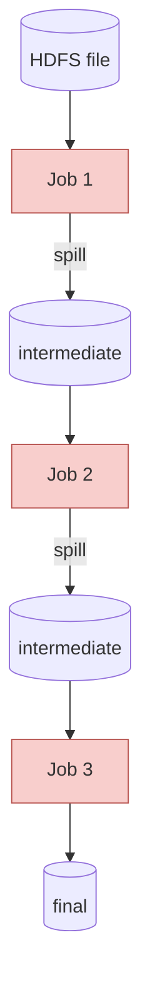
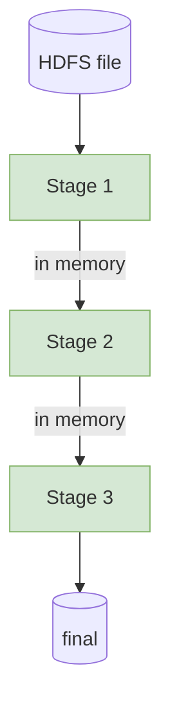

# Lecture 5 — MapReduce

*Companion to `lecture-5.md` (HDFS, YARN, and Local PySpark). This file goes deep on the compute model that HDFS + YARN were originally designed for — and the reason Spark replaced it.*

## Key Terms

- **ApplicationMaster (AM)**: YARN's per-job coordinator. Schedules mappers and reducers; reassigns failed tasks. *(Full treatment in the HDFS+YARN companion §2.)*
- **Mapper / Reducer worker**: A NodeManager process running a mapper or reducer task. Usually on the same physical machine as an HDFS DataNode process (data locality — two daemons, one box).
- **Shuffle**: The phase between Map and Reduce — mappers sort + split output by key on local disk; reducers pull their chunks over the network. *The only phase that crosses machine boundaries.*

## 1. MapReduce — The Original Compute Shape

MapReduce is a *shape* for distributed computation, not an API to memorize. You write two small functions — `map()` and `reduce()` — and the framework handles parallel scheduling, the shuffle, fault tolerance, and the output write. Three phases:

- **Map** *(parallel)* — one mapper per input split; emits `(key, value)` pairs.
- **Shuffle** *(framework)* — groups every pair by key across the cluster. The one phase that crosses machine boundaries.
- **Reduce** *(parallel)* — one reducer per key; folds the values into one answer.

Mappers run on the DataNode that holds their input split (data locality, covered in the HDFS+YARN companion). The shuffle is where the network bill comes due — usually the slowest part of any MR or Spark job.

### 1.1 Who runs what — phase by phase

With YARN's roles in hand (from the HDFS+YARN companion), the explicit phase-to-node mapping for a MapReduce job. The **ApplicationMaster** coordinates; the **NodeManager workers** (each sitting on a machine that also runs an HDFS DataNode daemon — same box, two separate processes) do all the reading, computing, and writing.

| Phase | Who runs it | What that node actually does |
|---|---|---|
| **Plan** | AM (coordinator) | Picks workers for mappers (near their blocks) and reducers (one per key range). Reassigns failed tasks. |
| **Map** | Mapper worker | Reads its HDFS block locally; runs `map()`; emits `(k, v)` pairs. |
| **Shuffle — write** | Same mapper worker | Sorts + partitions output by key range; writes to LOCAL disk (not HDFS). |
| **Shuffle — pull** | Reducer workers | Each reducer pulls its partition from every mapper's worker over the network. *The network-heavy step.* |
| **Reduce** | Reducer worker | Receives one key + the merged list of values; runs `reduce()`; emits the answer. |
| **Final write** | Reducer worker | Writes result to HDFS (replicated 3× by default — see companion §1.2). |

Both worked examples below trace each step to one of these rows.

### 1.2 Worked example A — Word count

**The job.** Count how often each distinct word appears in a body of text.

**Where the file lives.** Before any mapper runs, the file is already in HDFS — split into blocks, each block sitting on one worker's local disk. For our small example, pretend the file `play.txt` is large enough that HDFS split it into two blocks:

| Block | Stored on | Contents |
|---|---|---|
| `b1` | Worker A | `to be or not to be`<br>`the king is dead` |
| `b2` | Worker B | `long live the king`<br>`to be or to die` |

The AM places one mapper per block, on the worker that already holds it (data locality). So **Mapper 1 runs on Worker A** and reads `b1`; **Mapper 2 runs on Worker B** and reads `b2` — no network during the read. The text is designed so most words appear in *both* blocks, which makes the shuffle interesting later.

**Step 1 — `map()`.** Each mapper runs the same function on its slice, one line at a time. For every word in every line, emit `(word, 1)`:

```python
def map(line):
    for word in line.split():
        yield (word, 1)
```

What each mapper produces (one row per emit, in the order pairs stream out of `map()`):

**Mapper 1 — 10 pairs from `b1` on Worker A:**

| # | emit | from line |
|---|---|---|
| 1 | `(to, 1)`   | `to be or not to be` |
| 2 | `(be, 1)`   | ↑ |
| 3 | `(or, 1)`   | ↑ |
| 4 | `(not, 1)`  | ↑ |
| 5 | `(to, 1)`   | ↑ |
| 6 | `(be, 1)`   | ↑ |
| 7 | `(the, 1)`  | `the king is dead` |
| 8 | `(king, 1)` | ↑ |
| 9 | `(is, 1)`   | ↑ |
| 10 | `(dead, 1)` | ↑ |

**Mapper 2 — 9 pairs from `b2` on Worker B:**

| # | emit | from line |
|---|---|---|
| 1 | `(long, 1)` | `long live the king` |
| 2 | `(live, 1)` | ↑ |
| 3 | `(the, 1)`  | ↑ |
| 4 | `(king, 1)` | ↑ |
| 5 | `(to, 1)`   | `to be or to die` |
| 6 | `(be, 1)`   | ↑ |
| 7 | `(or, 1)`   | ↑ |
| 8 | `(to, 1)`   | ↑ |
| 9 | `(die, 1)`  | ↑ |

**Step 2 — Shuffle.** *Goal: every pair sharing a word lands at the same reducer.* Three sub-steps:

**(a) Plan.** AM assigns one reducer per distinct key.

**(b) Sort + split.** Each mapper sorts emits by key and splits them into one chunk per reducer, on local disk (no network yet):

| reducer | Mapper 1's disk (`b1`) | Mapper 2's disk (`b2`) |
|---|---|---|
| R-be   | `(be, 1) (be, 1)` | `(be, 1)` |
| R-dead | `(dead, 1)`       | — |
| R-die  | —                 | `(die, 1)` |
| R-is   | `(is, 1)`         | — |
| R-king | `(king, 1)`       | `(king, 1)` |
| R-live | —                 | `(live, 1)` |
| R-long | —                 | `(long, 1)` |
| R-not  | `(not, 1)`        | — |
| R-or   | `(or, 1)`         | `(or, 1)` |
| R-the  | `(the, 1)`        | `(the, 1)` |
| R-to   | `(to, 1) (to, 1)` | `(to, 1) (to, 1)` |

**(c) Pull.** Each reducer downloads its row from both mappers' disks and merges:

| reducer | merged values | sources |
|---|---|---|
| R-to   | `[1, 1, 1, 1]` | 2 from M1 + 2 from M2 |
| R-be   | `[1, 1, 1]`    | 2 from M1 + 1 from M2 |
| R-or   | `[1, 1]`       | 1 from each |
| R-the  | `[1, 1]`       | 1 from each |
| R-king | `[1, 1]`       | 1 from each |
| R-not, R-is, R-dead, R-long, R-live, R-die | `[1]` each | one mapper only |

**Step 3 — `reduce()`.** Each reducer sees one key plus its list of values and sums them:

```python
def reduce(word, ones):
    yield (word, sum(ones))
```

**Final output.**

| word | count |
|---|---|
| `to`   | 4 |
| `be`   | 3 |
| `or`   | 2 |
| `the`  | 2 |
| `king` | 2 |
| `not, is, dead, long, live, die` | 1 each |

At 10 TB the picture doesn't change — just more mappers and reducers in parallel. **You wrote two functions; the framework did the rest.**

### 1.3 Worked example B — Average trip duration per pickup hour (NYC taxi)

A more interesting example because **average isn't directly summable** — you can't compose partial averages by averaging them. The trick: emit BOTH the sum AND the count, and let the reducer divide at the end.

**The job.** Across all 3 M NYC yellow-taxi trips in January 2024, what's the average trip duration (in minutes) for each pickup hour 00–23?

**Input.** One row per trip; sample rows split across two mappers:

| Mapper 1 sees | Mapper 2 sees |
|---|---|
| `trip-1   pickup_hour=18   duration=12` | `trip-5   pickup_hour=18   duration=15` |
| `trip-2   pickup_hour=19   duration= 8` | `trip-6   pickup_hour=19   duration=10` |
| `trip-3   pickup_hour=18   duration=20` | `trip-7   pickup_hour=18   duration= 5` |
| `trip-4   pickup_hour=17   duration=30` | |

**Step 1 — `map()`.** Emit `(hour, (duration, 1))`. The `1` means "this row contributes one observation":

```python
def map(trip):
    yield (trip.hour, (trip.duration, 1))
```

What each mapper produces:

| Mapper 1 emits | Mapper 2 emits |
|---|---|
| `(18, (12, 1))` | `(18, (15, 1))` |
| `(19, ( 8, 1))` | `(19, (10, 1))` |
| `(18, (20, 1))` | `(18, ( 5, 1))` |
| `(17, (30, 1))` | |

**Step 2 — Shuffle.** *Goal: get every `(duration, 1)` pair sharing an hour into the reducer responsible for that hour.* Same three sub-steps as Example A:

**(a) Plan** — the AM decided ahead of time: hour 17 → reducer X, hour 18 → reducer Y, hour 19 → reducer Z.
**(b) Sort + split** — each mapper sorts its `(hour, (duration, 1))` output by hour on its local disk; one chunk per reducer.
**(c) Pull** — each reducer downloads its hour's chunk from BOTH mapper workers and merges them.

After (c):

| Reducer responsible for ... | merged values |
|---|---|
| `17` | `[(30, 1)]` |
| `18` | `[(12, 1), (20, 1), (15, 1), (5, 1)]` |
| `19` | `[(8, 1), (10, 1)]` |

**Step 3 — `reduce()`.** Each reducer sums durations and counts **separately**, then divides:

```python
def reduce(hour, pairs):
    total_duration = sum(d for d, _ in pairs)
    total_count    = sum(c for _, c in pairs)
    yield (hour, total_duration / total_count)
```

**Final output.**

| hour | average duration |
|---|---|
| 17 | 30.0 min  *(only one trip)*           |
| 18 | 13.0 min  *( = (12+20+15+5) / 4 )*    |
| 19 |  9.0 min  *( = (8+10) / 2 )*          |

**Why emit the count?** Averaging partial averages is wrong — Mapper 1's average has a different sample size than Mapper 2's, so averaging them again gives the wrong answer. **Always carry forward the raw quantities (sum, count); compute the derived statistic only at the end.** A real MapReduce design lesson.

### 1.4 What MapReduce is good at — and what it isn't

The Map → Shuffle → Reduce shape fits any problem you can express as: **"transform each record independently, then aggregate by some key."** That covers a surprising fraction of real analytics work. Here's a starter set of problems that map cleanly.

| Problem | Map emits | Reduce produces |
|---|---|---|
| **Word count** *(the canonical case)* | `(word, 1)` for every token in every line | `(word, total)` |
| **Aggregate by group** — total sales by region, avg trip duration per pickup hour | `(group_key, value)` for every record | `(group_key, sum)` or `(group_key, avg)` |
| **Inverted index** *(Google's original use case for MapReduce)* — for each word in the web, which pages contain it? | for each word in each document, emit `(word, doc_id)` | `(word, [doc_id_1, doc_id_2, ...])` — the index entry for that word |
| **Join two datasets on a key** — combine an orders table with a customers table | each record from both inputs emits `(join_key, ('orders', row))` or `(join_key, ('customers', row))` | reducer sees all records sharing that key from both sides; emits the joined output |

The common thread: **per-record independent work** (map) followed by **aggregation under a key** (reduce). If you can describe your problem in those two halves — even loosely — MR works.

#### Problems that *don't* fit cleanly

Some shapes look superficially similar but cost more than they should under MapReduce.

| Problem | Why it's awkward under MR |
|---|---|
| **Iterative algorithms** — PageRank, k-means clustering, gradient-descent ML training | Each iteration is a fresh MR job: full disk write at the end of one iteration, full disk read at the start of the next. 30 iterations = 30 disk round-trips on data that mostly didn't change. *This is exactly what motivated Spark — keep iterations in memory.* See §2. |
| **Random-access lookups** — "fetch user X by ID and update their balance" | MR scans every record. To touch one row out of a billion, this is absurdly expensive. Use a NoSQL store, a relational database, or a key-value cache instead. |
| **Real-time / low-latency queries** — sub-second response | MR job startup alone is seconds to minutes. Use Spark Structured Streaming, Flink, or a serving database for interactive workloads. |

A quick decision rule. **Can you write the computation as "for every record emit some `(k, v)` pairs; for every key combine the pairs"?** If yes — MR fits. If you need *"keep iterating until convergence,"* *"look up a specific record mid-job,"* or *"answer in under a second"* — reach for a different tool. We meet those tools in later weeks.

## 2. Why MapReduce Was Replaced

MapReduce works fine for one Map-then-Reduce job. Real analytics is a *chain* of them — and that's where MR breaks down.

**Why MR is slow:**

- Every job writes its output to HDFS before the next can read it
- N-stage pipeline = N+1 disk round-trips (each one: serialize → write → replicate 3× → read → deserialize)
- No global optimizer — each job is hand-wired to the next; the framework can't see that stage 2 only needs 3 of the columns stage 1 reads



Count the cylinders: **four HDFS round-trips** for what's conceptually one query.

**Spark's response:**

- Intermediates stay **in memory** between stages — only the final write hits HDFS
- **Catalyst optimizer** plans the whole DAG up front (predicate pushdown, column pruning, join reordering) before any task runs
- Spills to disk only when memory can't hold an intermediate



**One HDFS round-trip** (the final write). Result: Spark is roughly **10× faster** than MR on typical workloads.

But MR didn't disappear — it migrated underneath. Every Spark job, every SQL `GROUP BY`, every Flink streaming aggregation still runs the Map → Shuffle → Reduce shape.

### References

- Dean, Ghemawat. *MapReduce: Simplified Data Processing on Large Clusters*. OSDI 2004 — the canonical MR paper.
- Zaharia et al. *Spark: Cluster Computing with Working Sets* (2010); *Resilient Distributed Datasets* (2012) — the response to MR's iteration costs.
