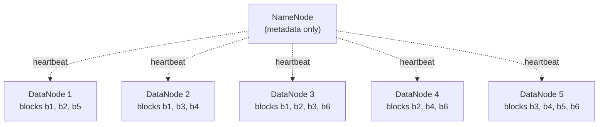
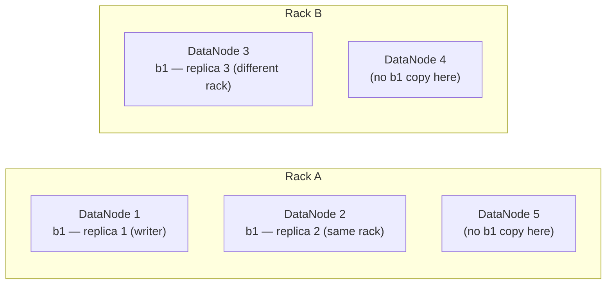
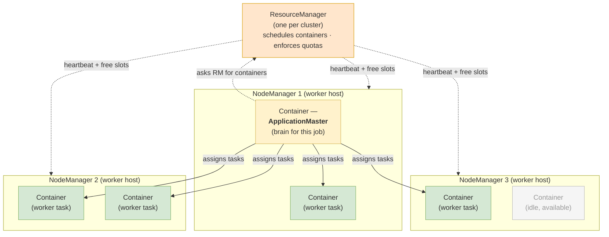
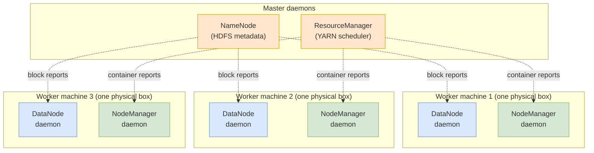

# Lecture 5 — HDFS, YARN, and Local PySpark

Hadoop's storage layer (HDFS), the scheduler that sits on it (YARN) — then PySpark on your laptop. **MapReduce**, the compute model these layers pioneered, has its own companion file: [`lecture-5-mapreduce.md`](./lecture-5-mapreduce.md).

## Key Terms

- **Block**: A fixed-size chunk of a file (default 128 MB) — the unit HDFS partitions files into.
- **NameNode**: Master server holding HDFS metadata (file → blocks → DataNodes). Never stores bytes itself.
- **DataNode**: Worker server holding the actual block bytes.
- **Replication factor**: Number of copies HDFS keeps of each block. Default 3.
- **Rack awareness**: Placement policy that spreads replicas across server racks so a whole rack going dark doesn't lose any block.
- **Data locality**: Scheduling computation on the worker that already holds the data — the reason HDFS exists.
- **YARN**: *Yet Another Resource Negotiator* — Hadoop's cluster scheduler. Allocates CPU + RAM **containers** to applications. Sits between HDFS and the compute frameworks (MR, Spark) that use it.

## 1. HDFS — Storage at Cluster Scale

HDFS solves one problem: how do you store and read files too big for one machine? Its answer is three moves: **split every file into fixed-size blocks** (default 128 MB; a 1 TB file becomes ~8,000 blocks), **scatter those blocks across many DataNodes** so total size is no longer one-machine-bound, and **replicate each block** to 3 different DataNodes so a disk failure doesn't lose data.

### 1.1 NameNode and DataNodes

Two server roles (defined in Key Terms above): one **NameNode** (master, metadata only) and many **DataNodes** (workers, block bytes only — tens to thousands per cluster).

The dashed edges are heartbeats — every few seconds each DataNode reports its current blocks. That's how the NameNode keeps its block-location table fresh and notices when a DataNode dies (no heartbeats → that node's blocks need re-replicating).

The NameNode keeps two in-memory maps. Together they let it answer any client request without ever touching block bytes itself:

| Map | Key → Value | Example (the file in the diagram above) |
|---|---|---|
| **Filesystem namespace** | file path → ordered list of block IDs | `/data/employees_2026.parquet` → `[b1, b2, b3, b4, b5, b6]` |
| **Block location service** | block ID → DataNodes holding it | `b1` → `DN1, DN2, DN3` · `b2` → `DN1, DN3, DN4` · *(full table in §1.2)* |

### 1.2 Replication

Disks fail. HDFS handles this by storing every block on **R** different DataNodes (default R = 3). For 6 blocks on 5 DataNodes:

| block | DataNode 1 | DataNode 2 | DataNode 3 | DataNode 4 | DataNode 5 | replicas |
|---|---|---|---|---|---|---|
| `b1` | R1 | R2 | R3 | — | — | 3 / 3 |
| `b2` | R1 | — | R2 | R3 | — | 3 / 3 |
| `b3` | — | R1 | R2 | — | R3 | 3 / 3 |
| `b4` | — | R1 | — | R2 | R3 | 3 / 3 |
| `b5` | R1 | — | — | — | R2 | **2 / 3 ⚠** |
| `b6` | — | — | R1 | R2 | R3 | 3 / 3 |

Read it two ways. **By row**: which DataNodes hold this block? **By column**: what blocks does this DataNode hold?

`b5` is **under-replicated** — only 2 of the required 3 copies. The NameNode sees this in heartbeat reports and copies the missing replica to a healthy DataNode; the replication factor is restored automatically. Same mechanism kicks in if a whole DataNode dies — every block in that column drops by one, then gets re-replicated.

### 1.3 Rack awareness

The DataNode that holds a new file's first replica is the **writer node**. HDFS places the 3 replicas relative to it, to survive a whole rack going dark:

- 1 replica on the **writer's node** itself.
- 1 more replica on the **same rack** as the writer.
- 1 replica on a **different rack**.

First two replicas are fast to write (shared top-of-rack switch). The third protects against rack-level failures — power loss, switch failure, cable yank.

## 2. YARN — Resource Scheduling

HDFS is the storage layer; YARN is the scheduler above it. YARN decides which jobs run on which workers, with how much CPU and memory each. MapReduce, Spark, Flink, and Tez all run their work through YARN.

Three roles:

- **ResourceManager** *(one per cluster)* — receives applications, schedules containers, enforces quotas.
- **NodeManager** *(one per worker host)* — reports the host's available resources to the RM and runs containers.
- **ApplicationMaster** *(one per app)* — negotiates with the RM and coordinates this app's containers.

A **container** is a slice of CPU + RAM on a specific NodeManager — where actual work runs.

The dashed edges are heartbeats and resource requests — control-plane traffic only, not user data. The solid edges show the **ApplicationMaster** (one per job, here living in NM1's first container) assigning tasks to worker containers across multiple NodeManagers. The ResourceManager hands out container slots; the AM decides what runs in them. Idle containers (NM3 here has one) are advertised back to the RM as available capacity.

In most deployments, each worker machine runs **two daemons side by side**: an HDFS **DataNode** (storing blocks on its local disk) and a YARN **NodeManager** (running compute containers on its CPU + RAM). They're two separate processes — different masters (NameNode vs ResourceManager), different protocols — that happen to live on the same physical machine.

Each worker box holds **two daemons**: blue is the DataNode (storage side, reporting to the NameNode); green is the NodeManager (compute side, reporting to the ResourceManager). Two independent control planes; one shared physical machine.

That co-location is what makes **data locality** possible: when the ApplicationMaster picks workers for a job's mapper tasks, it asks the NameNode where the input file's blocks live and schedules each mapper **on the machine whose NodeManager has capacity AND whose DataNode already holds the needed block**. The block bytes never cross the network during the map phase — this is the principle that justifies the whole HDFS + YARN architecture.

Spark in cluster mode borrows YARN's machinery: Spark's **Driver** runs inside the ApplicationMaster container; Spark's **Executors** are normal YARN containers. Same boxes, different names:

| YARN | Spark |
|---|---|
| ResourceManager | Cluster manager |
| ApplicationMaster | Driver (cluster mode) |
| Container | Executor process |
| Slot inside a container | Task slot (= one CPU core in the executor) |

The companion file [`lecture-5-mapreduce.md`](./lecture-5-mapreduce.md) traces a MapReduce job's phases through these components.

## 3. Spark on Your Laptop — Local Mode

The lab stack runs Spark in **local mode** (`master=local[*]`): no cluster, no YARN. The Driver (your Python program) and all Executors collapse into threads of one JVM, one thread per CPU core. Same PySpark API as a 1,000-node cluster — just toy scale.

Run `make hello` to verify. Live Spark UI on `http://localhost:4040` (per session); persistent History Server on `http://localhost:18080`. Open the UI during the lab — every concept from this lecture (driver, executor, partition, stage, shuffle) appears as a tab or column.

### References

- Ghemawat, Gobioff, Leung. *The Google File System*. SOSP 2003 — HDFS was modeled on it.

*MapReduce + Spark references are in the companion file [`lecture-5-mapreduce.md`](./lecture-5-mapreduce.md).*
