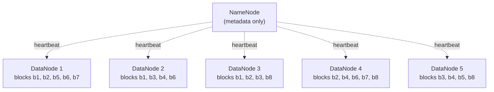
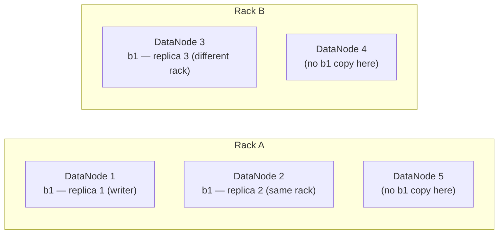
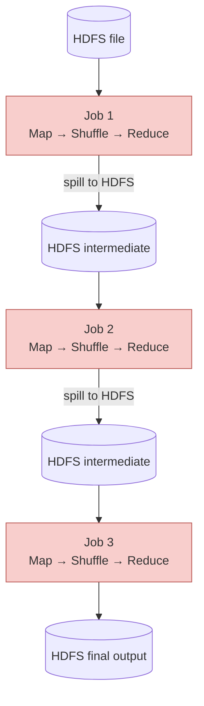
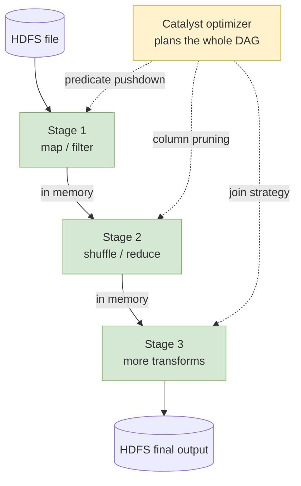

# Lecture 5 — HDFS, MapReduce, and Local PySpark

This lecture covers HDFS (storage), MapReduce (compute), YARN (scheduling), and Spark (the modern engine that replaced MapReduce). By the end you'll have PySpark running on your own laptop.

> **Modern context.** You will not write Hadoop MapReduce jobs in your career. In 2026, storage runs on S3 / GCS / Azure Blob and compute runs on Spark, Flink, and SQL engines. All of them carry forward HDFS's storage principles and MapReduce's execution shape — those are the foundations we'll learn.

## Key Terms

- **HDFS**: The Hadoop Distributed File System. Splits each file into fixed-size blocks and stores them across many worker machines.
- **Block**: A fixed-size chunk of a file (default 128 MB) — the unit HDFS partitions files into.
- **NameNode**: Master server holding HDFS metadata (file → blocks → DataNodes). Never stores bytes itself.
- **DataNode**: Worker server holding the actual block bytes.
- **Replication factor**: Number of copies HDFS keeps of each block. Default 3.
- **Rack awareness**: Placement policy that spreads replicas across server racks so a whole rack going dark doesn't lose any block.
- **Data locality**: Scheduling computation on the worker that already holds the data — the reason HDFS exists.
- **MapReduce**: Three-phase computation shape — *Map* (per-record work, parallel), *Shuffle* (group by key), *Reduce* (combine per key).
- **YARN**: *Yet Another Resource Negotiator* — Hadoop's cluster scheduler. Allocates CPU and RAM **containers** to applications. Sits between HDFS and compute frameworks (MR, Spark).
- **Spark**: Modern in-memory engine that replaced MapReduce. Same shape underneath; faster because it keeps intermediates in memory and plans the whole job up front.
- **Driver / Executor**: Spark's two roles. Driver runs your program; Executors run the tasks the Driver assigns.

## 1. HDFS — Storage at Cluster Scale

HDFS solves one problem: how do you store and read files too big for one machine? Its answer is three moves: **split every file into fixed-size blocks** (default 128 MB; a 1 TB file becomes ~8,000 blocks), **scatter those blocks across many DataNodes** so total size is no longer one-machine-bound, and **replicate each block** to 3 different DataNodes so a disk failure doesn't lose data.

### 1.1 NameNode and DataNodes

Two server roles:

- **NameNode** — master. Holds metadata: which files exist, what blocks they have, which DataNodes hold each block. Stores no block bytes.
- **DataNode** — worker. Stores blocks on local disk; serves them to clients. A cluster has tens to thousands.



The dashed edges are heartbeats — every few seconds each DataNode reports its current blocks. That's how the NameNode keeps its block-location table fresh and notices when a DataNode dies (no heartbeats → that node's blocks need re-replicating).

### 1.2 Replication

Disks fail. HDFS handles this by storing every block on **R** different DataNodes (default R = 3). For 8 blocks on 5 DataNodes:

| block | DataNode 1 | DataNode 2 | DataNode 3 | DataNode 4 | DataNode 5 | replicas |
|---|---|---|---|---|---|---|
| `b1` | R1 | R2 | R3 | — | — | 3 / 3 |
| `b2` | R1 | — | R2 | R3 | — | 3 / 3 |
| `b3` | — | R1 | R2 | — | R3 | 3 / 3 |
| `b4` | — | R1 | — | R2 | R3 | 3 / 3 |
| `b5` | R1 | — | — | — | R2 | **2 / 3 ⚠** |
| `b6` | R1 | R2 | — | R3 | — | 3 / 3 |
| `b7` | R1 | — | — | R2 | — | **2 / 3 ⚠** |
| `b8` | — | — | R1 | R2 | R3 | 3 / 3 |

Read it two ways. **By row**: which DataNodes hold this block? **By column**: what blocks does this DataNode hold?

`b5` and `b7` are **under-replicated** — only 2 of the required 3 copies. The NameNode sees this in heartbeat reports and copies the missing replica to a healthy DataNode; the replication factor is restored automatically. Same mechanism kicks in if a whole DataNode dies — every block in that column drops by one, then gets re-replicated.

### 1.3 Rack awareness

HDFS doesn't pick 3 random DataNodes. The placement policy survives a whole rack going dark:

- 1 replica on the **writer's node**.
- 1 more replica on the **same rack** as the writer.
- 1 replica on a **different rack**.



First two replicas are fast to write (shared top-of-rack switch). The third protects against rack-level failures — power loss, switch failure, cable yank.

### 1.4 Why this matters: data locality

When a compute job processes a file, the scheduler asks the NameNode where the blocks live, then starts tasks **on the DataNodes that already hold them**. Block bytes never cross the network during processing. This is **data locality** — the principle that justifies HDFS's entire design.

Cloud object storage (S3, GCS, Azure Blob) embodies the same ideas — distributed, replicated, separation of control plane from data plane. The API differs; the principles are HDFS's. Formal comparison in Week 10.

## 2. MapReduce — The Original Compute Shape

MapReduce is a *shape* for distributed computation, not an API to memorize. You write two small functions — `map()` and `reduce()` — and the framework handles parallel scheduling, the shuffle, fault tolerance, and writing output.

The three phases:

- **Map** *(parallel)* — one mapper task per input split. Reads its slice and emits `(key, value)` pairs. Stateless: each split is independent of every other.
- **Shuffle** *(framework)* — collects every `(k, v)` pair across the whole cluster and groups them by key. All pairs sharing a key end up at the same reducer. Network-heavy.
- **Reduce** *(parallel)* — one reducer per key (or per key range). Receives one key plus the list of values that came with it; emits the final answer for that key.

Mappers run **on the DataNode that already holds their input split** (data locality from §1.4). The map phase touches no network at all. The shuffle is where the network bill comes due — and it's usually the slowest part of any MR (or Spark) job.

### 2.1 Who runs what — coordinator vs workers

Before the examples, let's nail down WHICH PHYSICAL NODES handle each phase, because "Map runs" and "Shuffle happens" beg the question: *runs where? happens on which machine?*

A Hadoop / YARN cluster has two kinds of process:

- **One coordinator per job** — the YARN **ApplicationMaster** (AM). It runs in a container on some worker but functions as the "brain" for this specific job. Sits on top of YARN's ResourceManager.
- **Many workers** — **NodeManager** processes, one per physical machine. Most of them are also HDFS **DataNodes**, so the same box that holds your file's blocks is the box that runs tasks against them (data locality from §1.4).

The coordinator schedules and monitors. **It never touches your data.** All reading, computing, and writing happens on workers.

| Phase | Who runs it | What that node actually does |
|---|---|---|
| **Plan** | Coordinator (AM) | Picks which worker runs each mapper (chosen to sit on or near the HDFS block it'll read), and which workers run reducers + what key range each reducer owns. Reassigns failed tasks. |
| **Map** | A mapper process on a **worker** | Reads its assigned HDFS block locally (no network); applies the user's `map()`; emits `(k, v)` pairs. |
| **Shuffle — write side** | Same worker that ran the mapper | Sorts its `(k, v)` output and partitions it by which reducer will consume each key range; writes to the worker's LOCAL disk (not HDFS). |
| **Shuffle — pull side** | Reducer workers | Each reducer worker contacts every mapper's worker over the network and pulls just its assigned partition. *This is the network-heavy step.* |
| **Reduce** | A reducer process on a **worker** | Receives one key plus the merged list of values pulled from every mapper; applies the user's `reduce()`; emits the final answer for that key. |
| **Final write** | Reducer worker | Writes the result to HDFS (which replicates to 3 DataNodes per block, per §1.2). |

The **shuffle** is the one phase that crosses machine boundaries. Map output never leaves its mapper's local disk until reducers reach over the network and pull it. That worker-to-worker traffic is why "shuffle" is shorthand for "the slow part."

Keep this table in mind for the next two examples — every step we trace happens on either the coordinator (planning) or a worker (everything else).

### 2.2 Worked example A — Word count

**The job.** Count how often each distinct word appears in a body of text.

**Input.** A short text, split across two mappers:

| Mapper 1 sees | Mapper 2 sees |
|---|---|
| `to be or not to be`   | `that is the question` |
| `to thine own self`    | `the play is the thing` |

**Step 1 — `map()`.** Each mapper runs the same function on its slice, one line at a time. For every word in every line, emit `(word, 1)`:

```python
def map(line):
    for word in line.split():
        yield (word, 1)
```

What each mapper produces:

| Mapper 1 emits | Mapper 2 emits |
|---|---|
| `(to, 1) (be, 1) (or, 1) (not, 1) (to, 1) (be, 1)`    | `(that, 1) (is, 1) (the, 1) (question, 1)` |
| `(to, 1) (thine, 1) (own, 1) (self, 1)`               | `(the, 1) (play, 1) (is, 1) (the, 1) (thing, 1)` |

**Step 2 — Shuffle.** Each mapper writes its output to **its own worker's local disk**, sorted and partitioned by key. The AM has already picked which workers will run reducers and what key range each owns. Each reducer worker then pulls its partition from EVERY mapper's worker over the network. All `(to, 1)` pairs from any mapper land at the reducer worker responsible for `to`; all `(be, 1)` at the reducer worker for `be`; etc. *(This pull traffic is the "shuffle" phase — the one place network gets exercised.)*

| Reducer for ... | receives |
|---|---|
| `to`       | `[1, 1, 1]` |
| `be`       | `[1, 1]` |
| `the`      | `[1, 1, 1]` |
| `is`       | `[1, 1]` |
| `or`, `not`, `that`, `question`, `thine`, `own`, `self`, `play`, `thing` | `[1]` each |

**Step 3 — `reduce()`.** Each reducer sees one key plus its list of values and sums them:

```python
def reduce(word, ones):
    yield (word, sum(ones))
```

**Final output.**

| word | count |
|---|---|
| `to`   | 3 |
| `be`   | 2 |
| `the`  | 3 |
| `is`   | 2 |
| `or, not, that, question, thine, own, self, play, thing` | 1 each |

Scale to a 10 TB Shakespeare corpus and the picture doesn't change — just more mappers and more reducers running in parallel. **You wrote two functions; the framework did everything else** (split the file, schedule mappers next to their blocks, sort and group by key, route each group to a reducer, write the output).

### 2.3 Worked example B — Average trip duration per pickup hour (NYC taxi)

A more interesting example because **average isn't directly summable** — you can't compose partial averages by averaging them. The trick: emit BOTH the sum AND the count, and let the reducer divide at the end.

**The job.** Across all 3 M NYC yellow-taxi trips in January 2024, what's the average trip duration (in minutes) for each pickup hour 00–23?

**Input.** One row per trip; sample rows split across two mappers:

| Mapper 1 sees | Mapper 2 sees |
|---|---|
| `trip-1   pickup_hour=18   duration=12` | `trip-5   pickup_hour=18   duration=15` |
| `trip-2   pickup_hour=19   duration= 8` | `trip-6   pickup_hour=19   duration=10` |
| `trip-3   pickup_hour=18   duration=20` | `trip-7   pickup_hour=18   duration= 5` |
| `trip-4   pickup_hour=17   duration=30` | |

**Step 1 — `map()`.** Emit `(hour, (duration, 1))`. The `1` means "this row contributes one observation":

```python
def map(trip):
    yield (trip.hour, (trip.duration, 1))
```

What each mapper produces:

| Mapper 1 emits | Mapper 2 emits |
|---|---|
| `(18, (12, 1))` | `(18, (15, 1))` |
| `(19, ( 8, 1))` | `(19, (10, 1))` |
| `(18, (20, 1))` | `(18, ( 5, 1))` |
| `(17, (30, 1))` | |

**Step 2 — Shuffle.** Each mapper writes its `(hour, (duration, 1))` output to its own worker's local disk, partitioned by hour. The AM has assigned one reducer worker per hour. Each reducer worker pulls its hour's data from BOTH mapper workers across the network:

| Reducer for ... | receives (pulled from Mapper 1's worker + Mapper 2's worker) |
|---|---|
| `17` | `[(30, 1)]` |
| `18` | `[(12, 1), (20, 1), (15, 1), (5, 1)]` |
| `19` | `[(8, 1), (10, 1)]` |

**Step 3 — `reduce()`.** Each reducer sums durations and counts **separately**, then divides:

```python
def reduce(hour, pairs):
    total_duration = sum(d for d, _ in pairs)
    total_count    = sum(c for _, c in pairs)
    yield (hour, total_duration / total_count)
```

**Final output.**

| hour | average duration |
|---|---|
| 17 | 30.0 min  *(only one trip)*           |
| 18 | 13.0 min  *( = (12+20+15+5) / 4 )*    |
| 19 |  9.0 min  *( = (8+10) / 2 )*          |

**Why emit the count?** If you only emitted `(hour, duration)` and the reducer averaged what it received, the answer would still be correct *in this case* because there's only one reducer per hour. But the moment a *combiner* gets involved (a mini-reducer that runs on the map side to shrink data before shuffling), averaging partial averages is wrong — Mapper 1's average has a different sample size than Mapper 2's. **Always carry forward the raw quantities (sum, count) you need; compute the derived statistic only at the end.** That's a real MapReduce design lesson.

### 2.4 What MapReduce is good at — and what it isn't

The Map → Shuffle → Reduce shape fits any problem you can express as: **"transform each record independently, then aggregate by some key."** That covers a surprising fraction of real analytics work. Here's a starter set of problems that map cleanly.

| Problem | Map emits | Reduce produces |
|---|---|---|
| **Word count** *(the canonical case)* | `(word, 1)` for every token in every line | `(word, total)` |
| **Aggregate by group** — total sales by region, avg trip duration per pickup hour | `(group_key, value)` for every record | `(group_key, sum)` or `(group_key, avg)` |
| **Distributed grep / log filtering** — find every line in 10 TB of access logs that matched a slow query | mapper checks each line, emits `(date, 1)` if line matches the pattern; drops otherwise | `(date, count)` — how many slow queries per day |
| **Inverted index** *(Google's original use case for MapReduce)* — for each word in the web, which pages contain it? | for each word in each document, emit `(word, doc_id)` | `(word, [doc_id_1, doc_id_2, ...])` — the index entry for that word |
| **Distinct values / dedup** — how many unique IPs hit the site? | `(value, 1)` for each row | `(value, _)` — reducer emits exactly once per key; final count = number of reduced outputs |
| **Join two datasets on a key** — combine an orders table with a customers table | each record from both inputs emits `(join_key, ('orders', row))` or `(join_key, ('customers', row))` | reducer sees all records sharing that key from both sides; emits the joined output |
| **Top-N per group** — top 5 highest-grossing products per region | `(region, (product, revenue))` for every record | for each region, keep just the top 5 by revenue |
| **Histogram / value distribution** — distribution of trip durations across 3 M taxi rides | `(duration_bucket, 1)` | `(duration_bucket, count)` — bars of the histogram |

The common thread: **per-record independent work** (map) followed by **aggregation under a key** (reduce). If you can describe your problem in those two halves — even loosely — MR works.

#### Problems that *don't* fit cleanly

Some shapes look superficially similar but cost more than they should under MapReduce.

| Problem | Why it's awkward under MR |
|---|---|
| **Iterative algorithms** — PageRank, k-means clustering, gradient-descent ML training | Each iteration is a fresh MR job: full disk write at the end of one iteration, full disk read at the start of the next. 30 iterations = 30 disk round-trips on data that mostly didn't change. *This is exactly what motivated Spark — keep iterations in memory.* See §3. |
| **Sequential / stateful processing** — simulations where the next step depends on the previous step's result | MR mappers are stateless and parallel by design. Sequential dependencies defeat the model; you'd serialize through a single reducer (or chain jobs), losing all parallelism. |
| **Random-access lookups** — "fetch user X by ID and update their balance" | MR scans every record. To touch one row out of a billion, this is absurdly expensive. Use a NoSQL store, a relational database, or a key-value cache instead. |
| **Real-time / low-latency queries** — sub-second response | MR job startup alone is seconds to minutes. Use Spark Structured Streaming, Flink, or a serving database for interactive workloads. |
| **Global ordering** — one fully sorted list across the cluster | Sorting *within* a partition is automatic (the shuffle does it). Sorting *globally* requires careful range-partitioning (sample first, then route each key to the right reducer). Doable but not natural to MR. |

A quick decision rule. **Can you write the computation as "for every record emit some `(k, v)` pairs; for every key combine the pairs"?** If yes — MR fits. If you need *"keep iterating until convergence,"* *"look up a specific record mid-job,"* or *"answer in under a second"* — reach for a different tool. We meet those tools in later weeks.

## 3. Why MapReduce Was Replaced

MapReduce works perfectly for one Map-then-Reduce job. Real analytics is a *chain* of them — and MapReduce materializes every intermediate to HDFS.

A typical 3-stage pipeline in MapReduce — each job's intermediate result lands on HDFS before the next job can read it:



Count the cylinders: **four HDFS round-trips** for what's conceptually one query. No global optimizer either — each job is hand-wired to the next, and the framework has no way to see "stage 2 only needs 3 columns; stage 1 doesn't need to read the rest."

Spark keeps intermediates in memory and plans the whole DAG up front:



**One HDFS round-trip** (the final write). The yellow box is **Catalyst**, Spark's query optimizer — it sees the *whole pipeline* before any task runs and decides what each stage actually executes: push filters down into Stage 1 so Stage 2 sees less data, drop columns nobody reads, pick join algorithms stage by stage. Spills to disk only when memory can't hold an intermediate.

This makes Spark roughly **10× faster than MapReduce** on typical workloads. Internals come in the next lecture.

But MapReduce didn't disappear — it migrated underneath. Every Spark job, every SQL `GROUP BY`, every Flink streaming aggregation still runs the Map → Shuffle → Reduce shape. The shape is here to stay; only the engine on top changes.

## 4. YARN — Resource Scheduling

HDFS handles storage; YARN handles **compute scheduling** — who gets which CPU and RAM, on which worker, to run which job. MapReduce, Spark, Flink, and Tez all sit on top of YARN.

Three roles:

- **ResourceManager** *(one per cluster)* — receives applications, schedules containers, enforces quotas.
- **NodeManager** *(one per worker host)* — reports the host's available resources to the RM and runs containers.
- **ApplicationMaster** *(one per app)* — negotiates with the RM and coordinates this app's containers.

A **container** is a slice of CPU + RAM on a specific NodeManager — where actual work runs. Pictorially: one ResourceManager at the top; many NodeManagers below it (one per worker host); each NodeManager hosts one or more containers; one of those containers (per app) is special — it's the ApplicationMaster, which orchestrates the rest.

Spark in cluster mode borrows YARN's machinery: Spark's **Driver** runs inside the ApplicationMaster container; Spark's **Executors** are normal YARN containers. Same boxes, different names:

| YARN | Spark |
|---|---|
| ResourceManager | Cluster manager |
| ApplicationMaster | Driver (cluster mode) |
| Container | Executor process |
| Slot inside a container | Task slot (= one CPU core in the executor) |

You never write YARN code in this course. Spark talks to YARN on a Hadoop cluster; **Kubernetes** is increasingly common as a replacement. The same boxes (driver, executor, container) carry across both. On your laptop none of these schedulers run — that's the next section.

## 5. Spark on Your Laptop — Local Mode

The lab stack runs Spark in **local mode** (`master=local[*]`). No cluster, no YARN. The whole architecture collapses into one JVM:

- The **Driver** is your Python program (`SparkSession.builder.master("local[*]")`).
- Each **Executor** is a thread in that same JVM.
- `local[*]` = use all CPU cores as executor threads. On a 6-core laptop you get one driver and six executor threads, all in one process.

Same PySpark API as a 1,000-node cluster — `df.groupBy("col").count()` looks the same here and in production. Toy scale though: no parallelism beyond your cores, no data locality to optimize.

### 5.1 What `make hello` prints

The code-starter's smoke test (`make hello` → `00_hello_spark.py`) produces:

```
PySpark version: 4.1.1
Default parallelism: 6
Spark master:        local[*]

Jupyter Lab:    http://localhost:8888
Live Spark UI:  http://localhost:4040
History Server: http://localhost:18080

>>> Step 1: Start with a plain Python list of tuples
Python data (first 3 of 10): [(0, 0), (1, 1), (2, 4)]

...

Smoke test passed.
```

Each line maps to a concept above:

- `PySpark version` — the engine.
- `Default parallelism: 6` — number of executor threads (= your CPU cores; differs per machine).
- `Spark master: local[*]` — local mode, all cores.
- **Live Spark UI** — per-session UI on `:4040`. Jobs, stages, executors, DAG.
- **History Server** — persistent UI on `:18080`. Stores past runs.

Open the Spark UI during the live demo — every concept from this lecture (driver, executor, partition, stage, shuffle) appears as a tab or column.

### References

- Ghemawat, Gobioff, Leung. *The Google File System*. SOSP 2003 — HDFS was modeled on it.
- Dean, Ghemawat. *MapReduce: Simplified Data Processing on Large Clusters*. OSDI 2004.
- Zaharia et al. *Spark: Cluster Computing with Working Sets* (2010); *Resilient Distributed Datasets* (2012) — original Spark papers.
