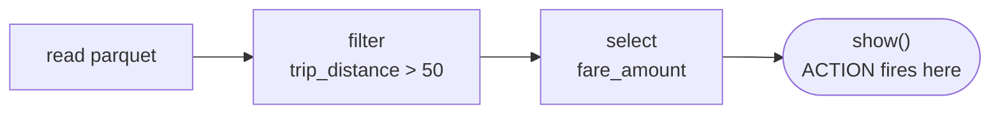
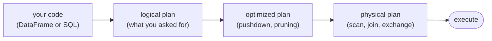
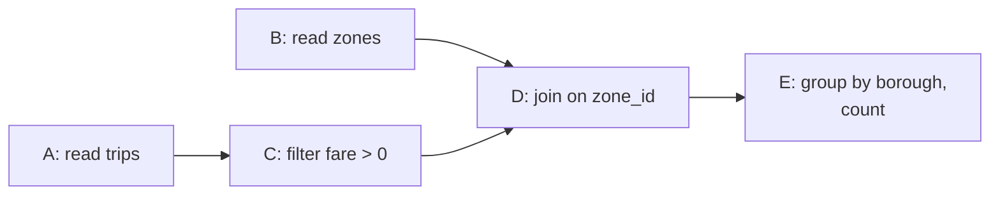
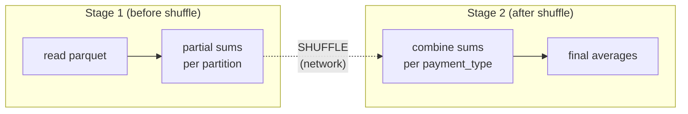
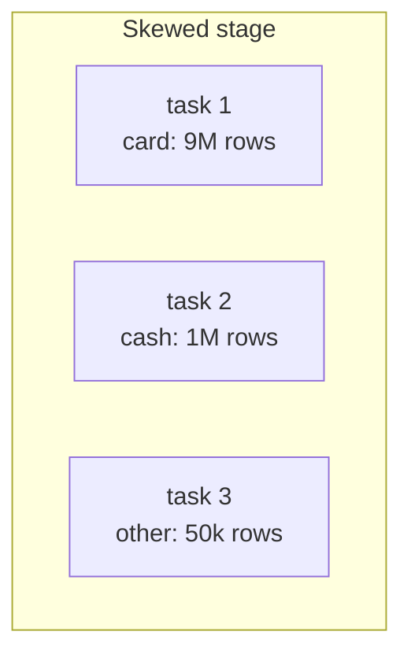
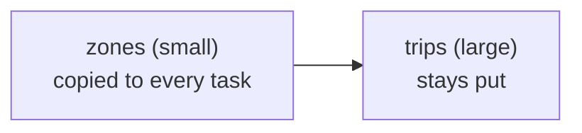
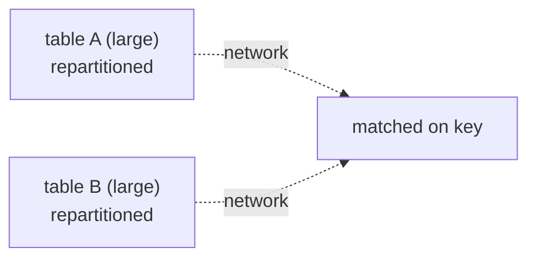

# Lecture 6 — Spark Foundations and Storage Formats

In Lecture 5 we started a `SparkSession`, ran a job, and watched it in the Spark UI. We treated Spark as a black box. Today we open the box. We will see what happens between the moment you write `df.filter(...)` and the moment a result appears, why Spark waits until the last possible moment to run anything, and where the expensive part of every job hides. We close by cashing in the Parquet layout from Lecture 4 and writing the same query two ways.

## Key Terms

- **DataFrame**: A table of rows and named columns. In Spark it is a *plan* for producing a table, not the table itself.
- **Transformation**: An operation that describes a new DataFrame from an old one (`filter`, `select`, `groupBy`). It runs nothing on its own.
- **Action**: An operation that asks for a result (`show`, `count`, `collect`, `write`). It triggers execution.
- **Lazy evaluation**: Spark records transformations and runs them only when an action fires.
- **Catalyst**: Spark's query optimizer. It rewrites your plan into a faster equivalent before running it.
- **DAG**: *Directed acyclic graph* — the graph of steps Spark builds for a job.
- **Stage**: A run of work with no shuffle inside it. Stage boundaries are shuffles.
- **Task**: One stage applied to one partition. Tasks are the unit Spark actually schedules.
- **Shuffle**: Moving data across the network so rows with the same key land together. The slowest part of most jobs.
- **Partition**: One chunk of a DataFrame. Spark processes partitions in parallel, one task each.
- **Skew**: When one partition or key holds far more data than the others, so one task runs long after the rest finish.

## 1. DataFrames and Lazy Evaluation

A DataFrame does not hold data. It holds a **plan** for producing data. When we write a chain of operations, Spark records each step and runs none of them:

```python
# Each line below returns instantly. No data is read, nothing is computed.
trips = spark.read.parquet("data/taxi")        # describe: "read this Parquet folder"
long_trips = trips.filter(trips.trip_distance > 50)  # describe: "keep long trips"
fares = long_trips.select("fare_amount")       # describe: "keep one column"
```

Operations split into two kinds. **Transformations** extend the plan and return a new DataFrame at once. **Actions** ask for an answer, and only then does Spark run the whole chain.

| | Transformation | Action |
|---|---|---|
| Examples | `filter`, `select`, `withColumn`, `groupBy`, `join` | `show`, `count`, `collect`, `write` |
| Returns | a new DataFrame (a plan) | a result — rows, a number, or files |
| Runs anything? | No. It only extends the plan. | Yes. It triggers the whole chain. |

So the chain above has built a three-step plan and touched no data. The moment we call an action, all of it runs:

```python
fares.show()   # ACTION: now Spark reads, filters, selects, and prints
```



The diagram shows the recorded plan. The three transformations build it up but do nothing. The `show()` action at the end is the trigger. Everything to its left runs in one go, in the order Spark decides is best.

This is **lazy evaluation**, and it is the point. Because Spark sees the whole chain before running it, it can rearrange the work. It can push the `filter` down to the read step so it never loads rows it will throw away. An eager system that ran each line as it arrived could not do that. The cost of laziness is one habit to unlearn: a DataFrame is cheap to define and expensive to *use*. Calling an action repeatedly re-runs the whole plan each time.

## 2. Catalyst — The Optimizer

Between your plan and the work that runs sits **Catalyst**, Spark's optimizer. It takes the plan you wrote, rewrites it into a cheaper equivalent, and only then produces the physical steps it will run.



The diagram shows the path your code takes before any data moves. Spark first turns the code into a logical plan that simply states what you asked for. Catalyst then rewrites that into an optimized plan, and finally picks concrete physical operators (which scan, which join type). Two of its rewrites matter most to us:

| Rewrite | What it does | On our taxi query |
|---|---|---|
| Predicate pushdown | Moves a `filter` down into the data source so the reader skips rows early | `trip_distance > 50` is applied during the Parquet read, not after |
| Column pruning | Reads only the columns the query actually references | Only `fare_amount` and `trip_distance` are read, not all ~40 |

We can see what Catalyst decided with `.explain()`:

```python
fares.explain()   # prints the physical plan Spark will run
```

The printed plan will show the filter pushed down into the Parquet scan and only `fare_amount` and `trip_distance` being read. This is where Lecture 4 pays off. Parquet stores data by column, so reading one column out of forty is cheap, and its row-group min/max stats let the reader skip whole chunks that cannot match the filter. The same query over a row-major CSV cannot prune columns or skip rows: it reads every byte. Catalyst writes the same logical query for both formats, but only the columnar format can honor the optimization.

## 3. From Plan to Execution — DAG, Stages, Tasks, Shuffle

When an action fires, Spark turns the plan into a **DAG** of steps, then splits that DAG into **stages**.

### 3.1 What a DAG is

A **DAG** — *directed acyclic graph* — is just a set of steps connected by arrows, under two rules:

- **Directed** — each arrow points one way, from a step to the step that depends on it. Work flows forward.
- **Acyclic** — the arrows never loop back. No step depends on its own output, so there is always a valid order to run things and the job is guaranteed to finish.
- **Graph** — steps can branch and merge. One step can feed several others, and one step can wait on several inputs. That is why it is a graph, not a straight line.

Spark builds a DAG because it records exactly which step depends on which. That tells Spark what it can run at the same time (steps with no shared dependency) and what has to wait (a step runs only once all its inputs are ready). Take a small workflow that reads two tables, cleans one, and joins them:

```python
trips = spark.read.parquet("data/taxi")             # A: read trips
zones = spark.read.parquet("data/zones")            # B: read zones
trips_clean = trips.filter(trips.fare_amount > 0)   # C: depends on A
joined = trips_clean.join(zones, "zone_id")         # D: depends on C and B
result = joined.groupBy("borough").count()          # E: depends on D
result.show()                                       # ACTION: runs A–E
```

Spark turns those five steps into this DAG:



The arrows are dependencies, not just sequence. A and B share no input, so Spark reads both at the same time. C waits for A. D is the interesting node: it waits for *both* C and B, and that merge is what makes this a graph rather than a line. E waits for D. Nothing loops back, so Spark always has a runnable next step and the job is guaranteed to end. This dependency graph is what Spark then carves into stages.

### 3.2 From the DAG to stages

Spark does not run the DAG in one piece. It groups the steps into **stages**, where a stage is the longest run of steps it can execute *without moving data across the network*. So the only question that decides where one stage ends and the next begins is: which steps force data to move? Separate operations into two kinds by how data moves:

| | Narrow | Wide |
|---|---|---|
| Examples | `filter`, `select`, `withColumn` | `groupBy`, `join`, `distinct`, `repartition`, `orderBy` |
| Each output partition depends on | one input partition | many input partitions |
| Data crosses the network? | No | Yes — this is the shuffle |
| Effect on stages | stays in the same stage | forces a new stage |

Narrow operations chain together inside one stage because each partition can be processed on its own — no step has to wait on data sitting on another machine. A wide operation is different: it has to regroup rows by key across the whole dataset, so rows move across the network. That movement is the **shuffle**, and it is the one thing that forces Spark to cut a new stage. That gives us the rule, simple and worth memorizing:

> A stage boundary is a shuffle.

Consider an average fare per payment type over the taxi data:

```python
# groupBy is a WIDE operation: it forces a shuffle, so this job has two stages.
result = trips.groupBy("payment_type").avg("fare_amount")
result.show()   # ACTION
```



The diagram shows the two stages and the shuffle between them. In Stage 1 each task reads its own partition and computes a partial sum and count locally. Then the shuffle moves those partial results across the network so that every row for a given `payment_type` lands on the same task. In Stage 2 each task combines the partials for its keys into a final average. Within each stage the work is narrow and parallel; the only network movement is the dashed shuffle edge.

A **task** is one stage applied to one partition. If Stage 1 reads 8 partitions, Spark schedules 8 tasks for it. This is the level the Spark UI shows you: a job made of stages, each stage made of tasks. When we open the UI for this job we will see two stages and an exchange between them. The mantra from the Lecture 5 MapReduce discussion holds here too: **the shuffle is where the network bill comes due**, and it is usually the slowest part of any job.

## 4. Partitions, Cardinality, and Skew

Because tasks map one-to-one onto partitions, the number and balance of partitions decides how the work parallelizes.

Spark's default shuffle partition count is **200** (`spark.sql.shuffle.partitions`). On a laptop running `local[*]` over small data that is far too many: most of those 200 tasks get almost no rows, and the scheduling overhead dominates. Lowering it is a common first tuning step:

```python
spark.conf.set("spark.sql.shuffle.partitions", 8)  # match small/local data
```

How many partitions you want depends on **cardinality** — the number of distinct values in the key. Some columns in the taxi data have very few distinct values, others have nearly one per row:

| Column | Distinct values | Cardinality |
|---|---|---|
| `VendorID` | 2 | very low |
| `payment_type` | ~6 | low |
| `passenger_count` | ~10 | low |
| `PULocationID` (pickup zone) | 265 | medium |
| `fare_amount` | thousands | high |
| `tpep_pickup_datetime` (timestamp) | ~millions, nearly one per row | very high |

Cardinality decides how a `groupBy` behaves. Grouping by a **low-cardinality** key like `payment_type` produces a handful of groups, so only a handful of partitions carry any work and the rest sit empty — this is also where skew tends to appear. Grouping by a **high-cardinality** key like `PULocationID` produces hundreds of groups that spread evenly across many partitions, which parallelizes well. Grouping by a **very-high-cardinality** key like the raw pickup timestamp is almost always a mistake: you get nearly as many groups as input rows, so the aggregation barely reduces the data at all.

The harder problem is **skew**: when one key holds far more rows than the others. Grouping taxi trips by payment type, if the overwhelming majority are card payments, then one task gets that giant group while the others finish quickly and sit idle. In the Spark UI this is unmistakable: one task runs long after every other task in its stage has completed.



The diagram shows the symptom: task 1 carries nearly all the rows and becomes the bottleneck for the whole stage, since a stage is not done until its slowest task is done. The remedies, in rough order of reach: raise the partition count, `repartition` on a key with better spread, or **salt** the hot key by splitting it into several synthetic sub-keys so its rows fan out across tasks. We name these here so you can recognize and describe skew; the detailed treatment comes in a later week.

## 5. Joins — Broadcast vs Shuffle

A join also regroups data by key, so by default it shuffles both sides. But there is a much cheaper path when one side is small.

| | Broadcast join | Shuffle join |
|---|---|---|
| Use when | one side is small (below the threshold) | both sides are large |
| What moves | the small table is copied to every executor | both sides are repartitioned across the network |
| Does the big table move? | No | Yes |
| Cost | cheap — no large shuffle | full shuffle on both sides |
| Name in `.explain()` | `BroadcastHashJoin` | `SortMergeJoin` |

Spark picks a broadcast join automatically when one side is below `spark.sql.autoBroadcastJoinThreshold`; otherwise it falls back to a shuffle join.

In a **broadcast join**, the small table is copied whole to every task and the large table stays where it is:



No large dataset crosses the network. Each task already holds the entire small table, so it can match its own slice of the big table locally. This is the cheap path, and it is what Spark chooses when one side fits under the threshold.

A **shuffle join** has no small side to copy, so both tables are repartitioned by the join key and sent across the network until matching keys meet on the same task:



Both sides pay the full shuffle cost. The rule to leave with: **a small dimension table joined to a big fact table should broadcast; two big tables must shuffle.**

```python
trips = spark.read.parquet("data/taxi")        # fact table: large
zones = spark.read.parquet("data/zones")       # dimension table: small
joined = trips.join(zones, "zone_id")          # Spark broadcasts the small side
joined.explain()                               # plan names "BroadcastHashJoin"
```

This is the **star schema**: one large **fact** table (the trips) surrounded by several small **dimension** tables (zones, vendors, rate codes). It is the standard shape for analytics, and it is exactly the shape broadcast joins handle best. One more layer of the same idea: **Hive-style directory partitioning** writes data into folders named by a column, like `/year=2026/month=06/`, so a query filtering on that column reads only the matching folders. It is the directory-level cousin of the Parquet row-group skipping from Lecture 4: skip data you do not need before you ever open it.

## 6. Spark SQL — The Same Engine, a Different Front Door

Everything so far used the DataFrame API. Spark also accepts plain SQL. Register a DataFrame as a view, then query it:

```python
trips.createOrReplaceTempView("trips")          # name the DataFrame for SQL
avg_fare = spark.sql("""
    SELECT payment_type, avg(fare_amount) AS avg_fare
    FROM trips
    GROUP BY payment_type
""")
avg_fare.show()
```

The important point is not the syntax. It is that this SQL and the DataFrame version from Section 3 compile to the **same physical plan**. Both go through Catalyst; both produce the same stages, the same shuffle, the same tasks. SQL is a front door, not a different engine. Run `.explain()` on each and you will see identical plans. Use whichever reads more clearly for the problem in front of you: SQL for set-oriented queries, the DataFrame API when you want to build a query up step by step in code.
